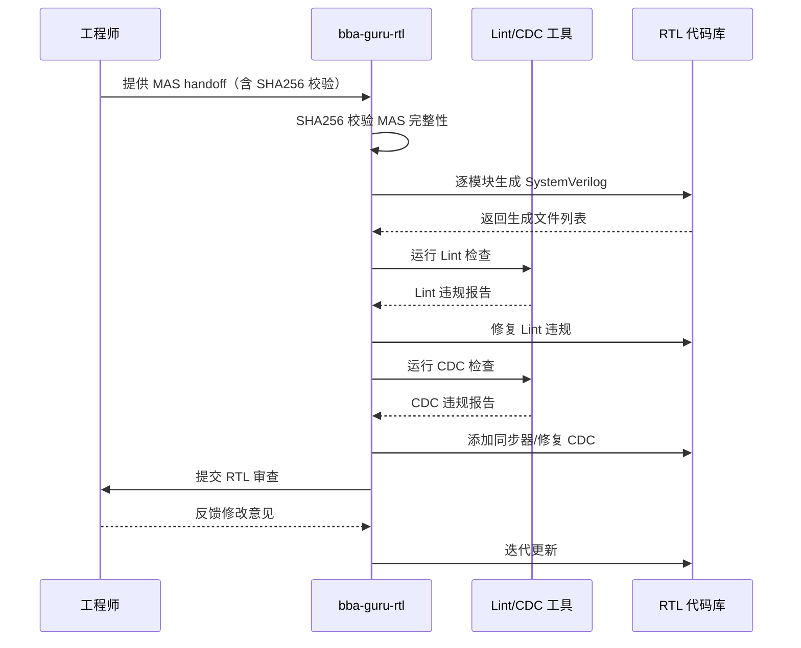
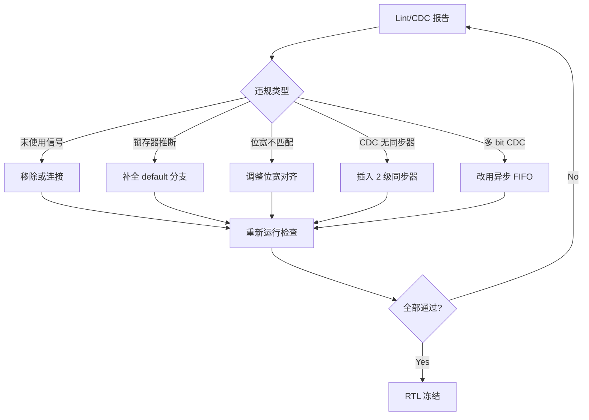

# 第 8 章：Agent 生成 RTL 代码

> **本章核心**：RTL 由 Agent 从 MAS 自动生成，人的角色是审查者和决策者。Agent 遵循编码规范生成 Lint-clean 的 SystemVerilog，并通过自动化 CDC 分析确保跨时钟域安全。

---

## 8.1 Agent RTL 生成流程

在 Babel 的 AI 原生流程中，RTL 代码不再由工程师逐行编写，而是由 Agent 从微架构规范（MAS）自动生成。整个过程是一个"生成 - 检查 - 修复"的闭环：



这个流程的关键特征：

1. **MAS 是唯一输入源**：Agent 不依赖口头描述或模糊指令，而是从结构化的 MAS 文档中提取端口定义、参数、行为描述和时序约束。
2. **SHA256 完整性校验**：Agent 在开始生成前，先校验 MAS 文档的 SHA256 哈希值，确保输入的 MAS 没有被意外修改，保证可追溯性。
3. **自动化 Lint/CDC 闭环**：Agent 不是"写完就走"，而是自动运行 Lint 和 CDC 检查，发现违规后自动修复，直到 Lint-clean。
4. **人做最终审查**：Agent 提交 Lint-clean 的 RTL 后，由工程师做功能和架构层面的审查。

## 8.2 使用 `/bba-guru-rtl` 启动 RTL 生成

### 输入：MAS Handoff

启动 RTL 生成的命令是 `/bba-guru-rtl`。Agent 需要的输入是 MAS handoff 包，包含：

| 输入项 | 说明 | 示例 |
|--------|------|------|
| MAS 文档集 | 各模块的微架构规范 | `spec/MAS/M00_SystolicArray.md` |
| MAS SHA256 | 文档完整性哈希 | `sha256:a3f2c8...` |
| ARCH 参考 | 时钟/复位/IO 规范 | `spec/ARCH/clock_reset_spec.md` |
| 编码规范 | SV 编码风格要求 | `wiki/codingstyle/systemverilog_styleguide.md` |

### Agent 工作流

Agent 的内部工作流分为四个阶段：

1. **MAS 解析**：从 MAS 文档中提取模块端口列表、参数定义、状态机描述、数据通路结构。
2. **代码生成**：按模块逐个生成 SystemVerilog 代码。以 NPU_top 项目为例，Agent 按照 MAS 计划中的模块依赖图顺序生成：先 Phase 1（M06_ClockManager、M07_ResetManager），再 Phase 2（M05_PowerManager、M04_SystemBus），依此类推。
3. **Lint 修复**：对生成的代码运行 Lint 检查，自动修复违规。
4. **CDC 处理**：识别跨时钟域信号路径，插入同步器。

### 输出：Lint-clean SystemVerilog

Agent 的输出是经过 Lint 和 CDC 检查的 SystemVerilog 文件。以 NPU_top 项目为例，输出文件组织如下：

```
rtl/designs/NPU_top/rtl/
  M00/src/M00_SystolicArray.sv
  M01/src/M01_DataflowController.sv
  M02/src/M02_SRAMScratchpad.sv
  M06/src/M06_ClockManager.sv
  ...
  NPU_top/src/NPU_top.sv
  file_list.f              # 文件编译顺序列表
```

`file_list.f` 文件记录了所有 RTL 文件的编译顺序，供后续仿真和综合使用：

```
rtl/M06/src/M06_ClockManager.sv
rtl/M07/src/M07_ResetManager.sv
rtl/M04/src/M04_SystemBus.sv
...
rtl/NPU_top/src/NPU_top.sv
```

## 8.3 RTL 编码规范

Agent 生成的 RTL 代码严格遵循项目的 SystemVerilog 编码规范。以下是 Babel 项目中的关键规范要点。

### 命名约定

| 类别 | 规范 | 示例 |
|------|------|------|
| 文件名 | `lowercase_with_underscore` | `m06_clock_manager.sv` |
| 模块名 | `lowercase_with_underscore` | `module m06_clock_manager` |
| 端口名 | 输入 `_i`，输出 `_o` | `clk_sys_i`, `clk_aon_o` |
| 参数 | `UPPERCASE_WITH_UNDERSCORES` | `DATA_WIDTH`, `FIFO_DEPTH` |
| 变量 | `lowercase_with_underscore` | `state_current`, `data_out_reg` |
| Struct | `camelCase` + `_s` 后缀 | `typedef struct packed { ... } packetHeader_s;` |
| Enum | `UPPERCASE_WITH_UNDERSCORES` | `IDLE`, `READ_DATA`, `WRITE_ACK` |

编码规范还要求：
- 缩进使用 4 个空格，禁止使用 Tab
- 每行最大长度 100 字符（考虑 UVM 宏定义较长）
- `begin` 与所属语句在同一行，`end` 独占一行
- `else` 独占一行（不在 `end` 后面）
- 条件语句始终使用 `begin/end`，即使只有一条语句
- 使用 closing identifier，如 `endmodule: M06_ClockManager`

### 代码结构模板

Agent 生成的每个模块遵循统一的结构：

```systemverilog
// Module: M06_ClockManager
//
// Clock management unit for NPU.
// Generates clk_sys, clk_aon, clk_io from external 50 MHz oscillator.
// Supports DVFS operating point switching.

module M06_ClockManager #(
    parameter AON_DIV_RATIO = 50  // AON clock divider ratio
)(
    // Clock & Reset
    input  logic        ext_clk_i,       // 50 MHz external oscillator
    input  logic        pll_lock_i,      // PLL lock status
    // DVFS Control
    input  logic [1:0]  dvfs_op_i,       // Operating point select
    input  logic        dvfs_req_i,      // DVFS switch request
    // Clock Gating
    input  logic [13:0] clk_gating_en_i, // Per-module clock gate enable
    input  logic        pd_aon_vdd_i,    // Always-on power domain valid
    // Clock Outputs
    output logic        clk_sys_o,       // System clock (250-500 MHz)
    output logic        clk_aon_o,       // Always-on clock (1 MHz)
    output logic        clk_io_o,        // IO clock (50 MHz)
    output logic [13:0] clk_gating_o,    // Per-module gated clocks
    // Status
    output logic        dvfs_ack_o,      // DVFS acknowledge
    output logic [2:0]  clk_status_o,    // Clock domain status
    output logic        pll_pwr_en_o     // PLL power enable
);

    // -------------------------------------------------------
    // Internal Signals
    // -------------------------------------------------------
    logic [5:0]  aon_div_counter;
    logic        aon_clk_pulse;
    logic        dvfs_req_prev;
    logic [13:0] clk_gating_sync;
    logic [15:0] timeout_counter;

    // -------------------------------------------------------
    // FSM: Clock State Machine
    // -------------------------------------------------------
    typedef enum logic [6:0] {
        ST_IDLE     = 7'b000_0001,
        ST_PLL_WAIT = 7'b000_0010,
        ST_AON_RUN  = 7'b000_0100,
        ST_SYS_RUN  = 7'b000_1000,
        ST_DVFS_REQ = 7'b001_0000,
        ST_DVFS_ACK = 7'b010_0000,
        ST_ERROR    = 7'b100_0000
    } state_e;

    state_e current_state, next_state;

    // -------------------------------------------------------
    // Sequential Logic
    // -------------------------------------------------------
    always_ff @(posedge clk_aon_o or negedge pd_aon_vdd_i) begin
        if (!pd_aon_vdd_i) begin
            current_state   <= ST_IDLE;
            dvfs_req_prev   <= 1'b0;
            timeout_counter <= 16'd0;
        end
        else begin
            current_state   <= next_state;
            dvfs_req_prev   <= dvfs_req_i;
            if (current_state != next_state)
                timeout_counter <= 16'd0;
            else if (|timeout_counter)
                timeout_counter <= timeout_counter + 16'd1;
        end
    end

    // -------------------------------------------------------
    // Combinational Logic
    // -------------------------------------------------------
    always_comb begin
        next_state = current_state;
        case (current_state)
            ST_IDLE: begin
                if (pd_aon_vdd_i)
                    next_state = ST_PLL_WAIT;
            end
            ST_PLL_WAIT: begin
                if (pll_lock_i)
                    next_state = ST_AON_RUN;
            end
            default: next_state = ST_IDLE;
        endcase
    end

endmodule: M06_ClockManager
```

### 可综合性保证

Agent 生成的代码保证可综合性，遵循以下规则：

- 使用 `always_ff` 描述时序逻辑，使用 `always_comb` 描述组合逻辑
- 不使用 `initial` 块（仅用于 testbench）
- 不使用 `#delay` 语法
- 不使用 `real` 类型进行运算
- 所有 `case` 语句包含 `default` 分支
- 所有 `if` 条件都有对应的 `else` 或明确的默认赋值，防止锁存器推断

## 8.4 审查 Agent 生成的 RTL

虽然 Agent 自动完成了 Lint 和 CDC 检查，但人工审查仍然不可省略。审查的重点不是语法细节（这些由工具保证），而是功能正确性和架构合理性。

### 审查清单

| 检查项 | 要点 | 常见问题 |
|--------|------|----------|
| 功能正确性 | 对照 MAS 逐条验证行为描述 | FSM 状态转移遗漏、边界条件未处理 |
| 端口完整性 | 所有 MAS 定义的端口是否都已实现 | 信号位宽不匹配、方向错误 |
| 复位正确性 | 复位值是否与 MAS 定义一致 | 异步/同步复位混用、复位遗漏 |
| 时钟域清晰性 | 跨时钟域信号是否都有同步器 | 多时钟域信号未经同步直接使用 |
| 参数化设计 | 关键尺寸是否参数化 | 硬编码常量、位宽写死 |
| 面积合理性 | 逻辑复杂度是否合理 | 不必要的并行展开、冗余逻辑 |

### 常见问题与修复反馈

当发现 Agent 生成的代码有问题时，给 Agent 的反馈应当具体且可执行：

**反面案例**（模糊指令）：
> "这个模块写得不对，改一下。"

**正面案例**（精确指令）：
> "M06_ClockManager 的 DVFS 状态机缺少 ST_DVFS_REQ 到 ST_ERROR 的超时转移路径。MAS 第 4.3 节规定：如果 DVFS 请求后 65535 个周期内未收到 pll_lock 响应，应转入 ERROR 状态并拉高 irq_err。请在 FSM 中添加此转移条件。"

## 8.5 RTL 设计模式

Agent 内置了一套经过验证的 RTL 设计模式库。以下是 Babel 项目中常用的四种模式。

### 模式 1：同步 FIFO

用于同一时钟域内的数据缓冲：

```systemverilog
module sync_fifo #(
    parameter DATA_WIDTH = 32,
    parameter FIFO_DEPTH = 16
)(
    input  logic                  clk_i,
    input  logic                  rst_n_i,
    input  logic                  wr_en_i,
    input  logic [DATA_WIDTH-1:0] wr_data_i,
    output logic                  full_o,
    input  logic                  rd_en_i,
    output logic [DATA_WIDTH-1:0] rd_data_o,
    output logic                  empty_o
);

    localparam ADDR_WIDTH = $clog2(FIFO_DEPTH);

    logic [DATA_WIDTH-1:0] mem [0:FIFO_DEPTH-1];
    logic [ADDR_WIDTH:0]   wr_ptr, rd_ptr;
    logic [ADDR_WIDTH:0]   count;

    assign full_o  = (count == FIFO_DEPTH);
    assign empty_o = (count == 0);

    always_ff @(posedge clk_i or negedge rst_n_i) begin
        if (!rst_n_i) begin
            wr_ptr <= '0;
            rd_ptr <= '0;
            count  <= '0;
        end
        else begin
            case ({wr_en_i & ~full_o, rd_en_i & ~empty_o})
                2'b10: begin
                    mem[wr_ptr[ADDR_WIDTH-1:0]] <= wr_data_i;
                    wr_ptr <= wr_ptr + 1;
                    count  <= count + 1;
                end
                2'b01: begin
                    rd_ptr <= rd_ptr + 1;
                    count  <= count - 1;
                end
                2'b11: begin
                    mem[wr_ptr[ADDR_WIDTH-1:0]] <= wr_data_i;
                    wr_ptr <= wr_ptr + 1;
                    rd_ptr <= rd_ptr + 1;
                    // count unchanged
                end
                default: ; // No operation
            endcase
        end
    end

    assign rd_data_o = mem[rd_ptr[ADDR_WIDTH-1:0]];

endmodule: sync_fifo
```

### 模式 2：valid/ready 握手协议

Babel 项目中模块间数据传输广泛使用 valid/ready 握手。以 M01_DataflowController 为例，其算子调度接口采用此协议：

```systemverilog
// M01_DataflowController 的算子调度接口（从综合网表可见）
output logic        op_valid,      // 操作有效信号
input  logic [3:0]  op_ready,      // 4 个执行单元各自的 ready 信号
output logic [7:0]  op_code,       // 操作码
output logic [3:0]  op_unit_sel,   // 目标执行单元选择
output logic        op_tid,        // 线程 ID
output logic [1:0]  op_precision,  // 精度选择（FP32/FP16/INT8/FP8）
output logic [31:0] op_src_addr,   // 源操作数地址
output logic [31:0] op_dst_addr,   // 目的操作数地址
```

握手协议的状态机实现：

```systemverilog
typedef enum logic [2:0] {
    IDLE,
    ISSUE_OP,
    WAIT_READY,
    OP_DONE,
    ERROR
} sched_state_e;

always_ff @(posedge clk_sys or negedge rst_sys_n) begin
    if (!rst_sys_n) begin
        sched_state <= IDLE;
        op_valid    <= 1'b0;
    end
    else begin
        case (sched_state)
            IDLE: begin
                if (start_en && instruction_valid) begin
                    sched_state <= ISSUE_OP;
                    op_valid    <= 1'b1;
                    op_code     <= decoded_opcode;
                    op_unit_sel <= decoded_unit;
                end
            end
            ISSUE_OP: begin
                if (|op_ready) begin  // 任一目标单元 ready
                    sched_state <= OP_DONE;
                    op_valid    <= 1'b0;
                end
                else if (timeout) begin
                    sched_state <= ERROR;
                    op_valid    <= 1'b0;
                end
            end
            OP_DONE: begin
                sched_state <= IDLE;
            end
            default: sched_state <= IDLE;
        endcase
    end
end
```

### 模式 3：流水线设计

脉动阵列（Systolic Array）是 Babel NPU 的核心计算单元，其本质是一个二维流水线结构。每个 Processing Element（PE）在时钟驱动下完成一次乘加运算（MAC），数据在 PE 间逐级流动：

```systemverilog
// 单个 PE 的简化实现
module pe_fp32 #(
    parameter PIPE_STAGES = 3  // MAC 流水线级数
)(
    input  logic        clk_i,
    input  logic        rst_n_i,
    input  logic [31:0] data_a_i,     // 来自左侧 PE
    input  logic [31:0] data_b_i,     // 来自上方 PE
    input  logic        valid_i,
    output logic [31:0] data_a_o,     // 传递给右侧 PE
    output logic [31:0] data_b_o,     // 传递给下方 PE
    output logic [31:0] result_o,     // 累加结果
    output logic        valid_o
);

    // 流水线寄存器
    logic [31:0] mult_pipe [0:PIPE_STAGES-1];
    logic [31:0] acc_reg;
    logic [PIPE_STAGES-1:0] valid_pipe;

    // 乘法级
    always_ff @(posedge clk_i or negedge rst_n_i) begin
        if (!rst_n_i) begin
            mult_pipe[0] <= '0;
            valid_pipe[0] <= 1'b0;
        end
        else begin
            mult_pipe[0] <= data_a_i * data_b_i;  // FP32 MAC 关键路径约 1.8ns
            valid_pipe[0] <= valid_i;
        end
    end

    // 后续流水线级
    genvar i;
    generate
        for (i = 1; i < PIPE_STAGES; i++) begin : pipe_stage
            always_ff @(posedge clk_i or negedge rst_n_i) begin
                if (!rst_n_i) begin
                    mult_pipe[i]  <= '0;
                    valid_pipe[i] <= 1'b0;
                end
                else begin
                    mult_pipe[i]  <= mult_pipe[i-1];
                    valid_pipe[i] <= valid_pipe[i-1];
                end
            end
        end
    endgenerate

    // 累加
    always_ff @(posedge clk_i or negedge rst_n_i) begin
        if (!rst_n_i)
            acc_reg <= '0;
        else if (valid_pipe[PIPE_STAGES-1])
            acc_reg <= acc_reg + mult_pipe[PIPE_STAGES-1];
    end

    assign result_o = acc_reg;
    assign valid_o  = valid_pipe[PIPE_STAGES-1];
    assign data_a_o = data_a_i;  // 数据水平传递
    assign data_b_o = data_b_i;  // 数据垂直传递

endmodule: pe_fp32
```

MAS 计划中特别指出 FP32 MAC 的关键路径约为 1.8ns，在 500 MHz（周期 2.0ns）下仅有 0.2ns 的时序裕量，因此 Agent 在生成 SystolicArray 模块时会考虑流水线插入以满足时序要求。

### 模式 4：跨时钟域（CDC）同步器

Babel NPU 有三个时钟域：CLK_SYS（250-500 MHz）、CLK_AON（1 MHz）、CLK_IO（50 MHz）。根据 `clock_reset_spec.md`，CDC 策略如下：

| 源域 | 目标域 | 同步方法 | 验证方式 |
|------|--------|----------|----------|
| CLK_SYS -> CLK_AON | 2 级同步器 | STA CDC check |
| CLK_AON -> CLK_SYS | 握手协议 | 形式验证 |
| CLK_SYS -> CLK_IO | 异步 FIFO | FIFO 深度检查 |

2 级同步器的标准实现：

```systemverilog
module sync_2stage #(
    parameter WIDTH = 1
)(
    input  logic             clk_dst_i,
    input  logic             rst_dst_n_i,
    input  logic [WIDTH-1:0] data_src_i,
    output logic [WIDTH-1:0] data_dst_o
);

    logic [WIDTH-1:0] sync_reg_0, sync_reg_1;

    always_ff @(posedge clk_dst_i or negedge rst_dst_n_i) begin
        if (!rst_dst_n_i)
            sync_reg_0 <= '0;
        else
            sync_reg_0 <= data_src_i;
    end

    always_ff @(posedge clk_dst_i or negedge rst_dst_n_i) begin
        if (!rst_dst_n_i)
            sync_reg_1 <= '0;
        else
            sync_reg_1 <= sync_reg_0;
    end

    assign data_dst_o = sync_reg_1;

endmodule: sync_2stage
```

在 M06_ClockManager 的实际综合网表中可以看到，Agent 正确使用了同步寄存器来处理 `clk_gating_en` 信号从 CLK_SYS 到 CLK_AON 的跨域传递：

```verilog
// 从综合网表 M06_ClockManager 中提取
always @(posedge clk_aon_o)
    if (!pd_aon_vdd_i) clk_gating_sync[0] <= 1'h0;
    else clk_gating_sync[0] <= clk_gating_en_i[0];
```

## 8.6 Lint 检查与 CDC 分析

### Lint 检查：`/bb-check-lint`

Lint 工具对 RTL 代码进行静态规则检查，发现潜在的设计缺陷。Agent 通过 `/bb-check-lint` 调用 Lint 检查。常见的 Lint 规则包括：

| 规则 | 说明 | 严重等级 |
|------|------|----------|
| W101 | 信号未使用（unused signal） | Warning |
| W102 | 信号未驱动（undriven signal） | Error |
| W103 | 组合逻辑环路（combinational loop） | Error |
| W104 | 锁存器推断（latch inferred） | Warning |
| W105 | 位宽不匹配（width mismatch） | Warning |
| W106 | 多驱动（multiple drivers） | Error |
| W107 | 不完整 case 语句 | Warning |

Agent 的 Lint 修复策略：

- **W101（未使用信号）**：确认信号确实不需要后移除，或连接到正确的逻辑
- **W104（锁存器推断）**：在 `always_comb` 块中添加完整的默认赋值
- **W105（位宽不匹配）**：调整赋值语句的位宽对齐
- **W107（不完整 case）**：添加 `default` 分支

### CDC 分析：`/bb-check-cdc`

CDC（Clock Domain Crossing）分析识别跨时钟域的信号路径，检查是否正确处理。Agent 通过 `/bb-check-cdc` 调用 CDC 分析。

CDC 分析的检查要点：

1. **单 bit 信号**：必须经过 2 级同步器
2. **多 bit 信号**：必须使用异步 FIFO 或握手协议
3. **格雷码转换**：FIFO 指针跨域传递必须使用格雷码
4. **复位信号**：异步复位需要同步释放

### Agent 自动修复 Lint/CDC 的流程

Agent 不是简单地报告问题，而是自动修复：



---

## 本章小结

1. **MAS 驱动生成**：RTL 代码由 Agent 从 MAS 规范自动生成，MAS 文档的 SHA256 校验确保输入完整性。
2. **Lint/CDC 自动闭环**：Agent 生成代码后自动运行 Lint 和 CDC 检查，发现违规后自动修复，直到代码 Lint-clean。
3. **编码规范一致性**：Agent 遵循统一的 SystemVerilog 编码规范，包括命名约定、代码结构和可综合性保证。
4. **人的审查不可替代**：Agent 保证语法和规则层面的正确性，但功能正确性和架构合理性需要工程师审查确认。
5. **设计模式标准化**：FIFO、valid/ready 握手、流水线、CDC 同步器等常用设计模式由 Agent 内置，确保复用和一致性。
