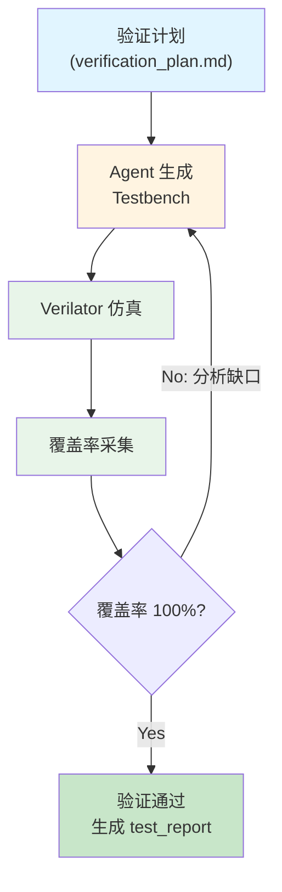
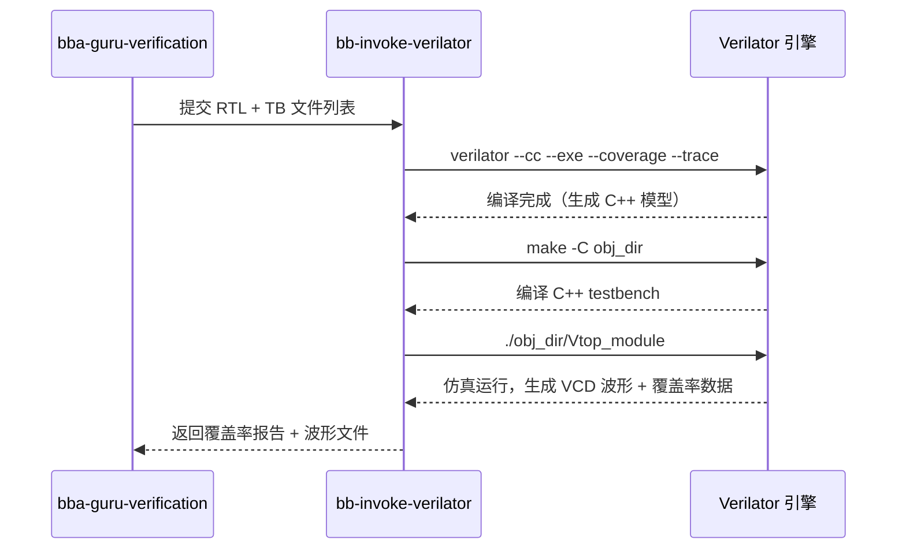

# 第 9 章：Agent 驱动的验证闭环

> **本章核心**：Agent 自动生成 Testbench、运行仿真、驱动覆盖率收敛到 100%。验证不再是"写完 TB 跑一下"，而是一个由覆盖率数据驱动的自动化闭环。

---

## 9.1 Agent 验证闭环

传统的验证流程中，工程师手动编写 testbench、运行仿真、查看波形、分析覆盖率缺口，再手动补充测试用例。在 Babel 的 AI 原生流程中，这整个过程被 Agent 自动化，形成一个数据驱动的闭环：



这个闭环的核心逻辑：

1. **验证计划驱动**：Agent 从 ARCH 文档中的 `verification_plan.md` 读取验证场景、覆盖率目标和关键测试用例。
2. **自动生成 TB**：Agent 根据验证计划生成 testbench 组件，包括 driver、monitor、scoreboard 和 golden model。
3. **仿真与覆盖率**：Agent 调用 Verilator 运行仿真，采集代码覆盖率和功能覆盖率数据。
4. **缺口分析与补充**：如果覆盖率未达 100%，Agent 分析未覆盖的代码路径或功能点，自动生成补充测试用例。
5. **迭代至收敛**：循环执行直到所有覆盖率指标达标。

## 9.2 使用 `/bba-guru-verification` 启动验证

### 输入

启动验证流程的命令是 `/bba-guru-verification`。Agent 需要的输入：

| 输入项 | 说明 | 示例 |
|--------|------|------|
| RTL 代码 | 待验证的模块 | `rtl/designs/NPU_top/rtl/M06/src/M06_ClockManager.sv` |
| 验证计划种子 | 从 verification_plan.md 提取的场景 | 验证场景、覆盖率目标 |
| MAS 参考 | 模块的功能规范 | MAS 文档中的行为描述 |
| ARCH 参考 | 系统级验证约束 | 时钟/复位/IO 规范 |

### Agent 工作流

Agent 的验证工作流分为五个阶段：

1. **分析设计**：阅读 RTL 代码和 MAS，理解模块功能、端口、状态机和数据通路。
2. **生成 TB**：创建 testbench 架构，包括 TB_TOP、TB_DRIVER、TB_MONITOR、TB_GOLDEN、TB_SCOREBOARD。
3. **运行仿真**：调用 `/bb-invoke-verilator` 编译和运行仿真。
4. **分析覆盖率**：调用 `/bb-collect-coverage` 采集覆盖率数据，识别缺口。
5. **迭代补充**：针对覆盖率缺口生成补充测试用例，重新运行仿真。

### 输出：test_report

Agent 的最终输出是结构化的测试报告（test_report），包含：

```json
{
  "design_name": "M06_ClockManager",
  "test_count": 15,
  "pass_count": 15,
  "fail_count": 0,
  "functional_coverage": 100,
  "code_coverage": {
    "line": 100,
    "branch": 100,
    "toggle": 100
  },
  "assertion_coverage": 100,
  "test_scenarios": [
    "reset_sequence",
    "pll_lock_normal",
    "pll_lock_timeout",
    "dvfs_op0_to_op1",
    "dvfs_op1_to_op0",
    "dvfs_invalid_op",
    "clock_gating_enable_disable",
    "aon_clock_division",
    "power_domain_transition"
  ],
  "bugs_found": 2,
  "bugs_fixed": 2,
  "status": "PASS"
}
```

### Testbench 架构

Babel 项目的 Testbench 遵循标准化的层次结构（来自 `verification_plan.md`）：

| 组件 | 功能 | Agent 生成方式 |
|------|------|---------------|
| TB_TOP | 顶层 testbench，实例化 DUT 和所有子组件 | Agent 根据 RTL 端口自动生成 |
| TB_DRIVER | 输入激励生成器 | Agent 根据验证场景生成定向/随机激励 |
| TB_MONITOR | 输出响应采集器 | Agent 根据 DUT 输出端口生成采集逻辑 |
| TB_GOLDEN | 黄金参考模型 | Agent 根据 MAS 行为描述生成 C/C++ 参考模型 |
| TB_SCOREBOARD | 结果比较器 | Agent 生成比较逻辑，支持容差比较 |

TB_GOLDEN 是验证正确性的基准。对于计算类模块（如 M00_SystolicArray），Agent 会生成一个 C/C++ 参考模型，在相同的输入下计算期望输出，然后 TB_SCOREBOARD 将 DUT 的实际输出与参考模型的期望输出进行比较：

```systemverilog
// TB_SCOREBOARD 的比较逻辑示例
task check_result(input [31:0] actual, input [31:0] expected,
                  input [31:0] tolerance);
    logic [31:0] diff;
    diff = (actual > expected) ? (actual - expected)
                                : (expected - actual);
    if (diff <= tolerance) begin
        pass_count++;
    end
    else begin
        fail_count++;
        $error("MISMATCH: actual=0x%08h expected=0x%08h diff=0x%08h",
               actual, expected, diff);
    end
endtask
```

对于 NPU 的混合精度计算，精度验证尤为关键。验证计划定义了各精度模式下的容差标准：

| 精度 | 测试方法 | 精度损失目标 | 对应需求 |
|------|---------|-------------|---------|
| FP32 | Golden reference | Baseline（无损失） | REQ-COMPUTE-007 |
| FP16 | vs FP32 | <= 0.5% | UC-03 |
| INT8 | vs FP32 | <= 0.5% | UC-03 |
| FP8 | vs FP32 | <= 0.5% | UC-03 |

### 验证层次与回归策略

Babel 项目采用分层验证策略，从模块级到系统级逐步推进：

| 验证层次 | 方法 | 覆盖率目标 | 周期 |
|----------|------|-----------|------|
| Unit（模块级） | RTL 仿真 | 100% code, 95% functional | 每个模块 |
| Integration（集成级） | RTL 仿真 | 95% functional | 数天 |
| System（系统级） | FPGA 仿真 | 端到端场景 | 数周 |
| Silicon（芯片级） | Post-silicon validation | 所有使用场景 | 数月 |

回归测试策略确保每次 RTL 修改不会引入回归问题：

| 回归层次 | 频率 | 时长 |
|----------|------|------|
| Unit 回归 | 每次 commit | 分钟级 |
| Integration 回归 | 每日 | 小时级 |
| System 回归 | 每周 | 天级 |
| Full regression | 发布前 | 天级 |

## 9.3 验证方法论

### 定向测试 vs 约束随机测试

Babel 项目结合两种方法：

| 方法 | 适用场景 | Agent 策略 |
|------|----------|------------|
| 定向测试 | 基本功能验证、边界条件 | Agent 根据 MAS 逐条生成确定性测试 |
| 约束随机测试 | 覆盖率收敛、意外场景 | Agent 生成约束条件，由仿真引擎随机化 |

**定向测试**用于验证已知功能。例如验证 M06_ClockManager 的 PLL 锁定序列：

```systemverilog
// 定向测试：验证 PLL 锁定后时钟输出正常
task test_pll_lock_sequence();
    // 1. 复位
    pd_aon_vdd_i = 0;
    ext_clk_i = 0;
    #100;
    pd_aon_vdd_i = 1;
    #100;

    // 2. 等待 PLL 锁定
    pll_lock_i = 0;
    #200;  // PLL 配置时间
    pll_lock_i = 1;
    #50;   // PLL 锁定后稳定

    // 3. 检查 AON 时钟开始输出
    @(posedge clk_aon_o);
    $display("PASS: AON clock active after PLL lock");

    // 4. 检查 clk_status_o 反映正确状态
    assert(clk_status_o[0] == 1'b1)
        else $error("FAIL: clk_status[0] should be 1 after AON active");
endtask
```

**约束随机测试**用于覆盖率收敛。Agent 生成约束条件，让仿真引擎产生随机激励：

```systemverilog
// 约束随机：DVFS 操作点随机切换
class dvfs_sequence;
    rand bit [1:0] op_select;
    rand int       interval_cycles;

    constraint valid_op {
        op_select inside {0, 1, 2};  // 排除无效值 3
    }
    constraint reasonable_interval {
        interval_cycles inside {[100:10000]};
    }
endclass

task run_dvfs_random(int num_sequences = 100);
    dvfs_sequence seq;
    seq = new();
    for (int i = 0; i < num_sequences; i++) begin
        assert(seq.randomize());
        dvfs_op_i = seq.op_select;
        dvfs_req_i = 1;
        repeat(seq.interval_cycles) @(posedge clk_aon_o);
        dvfs_req_i = 0;
        @(posedge dvfs_ack_o);
    end
endtask
```

### 覆盖率驱动验证（CDV）

覆盖率驱动验证（Coverage-Driven Verification）的核心思想：验证的完成标准不是"跑了多少测试"，而是"覆盖了多少设计空间"。Agent 的 CDV 策略：

1. **定义覆盖率模型**：从 MAS 中提取功能覆盖点（coverpoint）和交叉覆盖（cross coverage）
2. **运行初始测试**：执行定向测试集，建立覆盖率基线
3. **分析缺口**：识别未覆盖的 coverpoint bin
4. **生成补充测试**：针对每个未覆盖的 bin 生成定向或约束随机测试
5. **验证收敛**：重复直到所有 coverpoint 100% 覆盖

## 9.4 覆盖率指标详解

Babel 项目的验证计划（`verification_plan.md`）定义了严格的覆盖率要求：

### 覆盖率要求

| 覆盖率类型 | 目标 | 采集工具 |
|-----------|------|----------|
| Code Coverage (Line) | 100% | Verilator + coverage |
| Code Coverage (Branch) | 100% | Verilator + coverage |
| Code Coverage (Toggle) | 100% | Verilator + coverage |
| Functional Coverage | 95% | 自定义 assertions |
| Assertion Coverage | 100% | SVA |

### 代码覆盖率

**Line Coverage（行覆盖率）**：RTL 代码中每一行是否被执行过。100% 意味着所有代码路径至少被仿真执行一次。

**Branch Coverage（分支覆盖率）**：每个条件判断的 true 和 false 分支是否都被执行过。例如：

```systemverilog
if (pll_lock_i)          // true branch: pll_lock=1 时测试
    next_state = AON_RUN; // false branch: pll_lock=0 时也要测试
```

**Toggle Coverage（翻转覆盖率）**：每个信号的 0->1 和 1->0 翻转是否都发生过。对于位宽较大的信号（如地址总线），需要确保每一位都翻转。

### 功能覆盖率

功能覆盖率由 Agent 根据 MAS 定义的功能点（coverpoint）采集。以 M01_DataflowController 为例：

```systemverilog
// 功能覆盖点定义
covergroup dataflow_cg @(posedge clk_sys);
    // 算子类型覆盖
    cp_opcode: coverpoint op_code {
        bins matmul  = {8'h08, 8'h09, 8'h0A};  // 矩阵乘法指令
        bins special = {8'h10, 8'h11, 8'h12, 8'h13, 8'h14};  // 特殊函数
        bins memory  = {8'h20, 8'h21, 8'h22, 8'h23, 8'h24, 8'h25};  // 内存访问
        bins kv_cache = {8'h28, 8'h29, 8'h2A};  // KV Cache 操作
        bins scalar  = {8'h30, 8'h31, 8'h32, 8'h33, 8'h34};  // 标量/控制
    }

    // 精度模式覆盖
    cp_precision: coverpoint op_precision {
        bins fp32 = {2'b00};
        bins fp16 = {2'b01};
        bins int8 = {2'b10};
        bins fp8  = {2'b11};
    }

    // 线程覆盖
    cp_thread: coverpoint op_tid {
        bins thread_0 = {0};
        bins thread_1 = {1};
    }

    // 交叉覆盖：精度 x 线程
    cx_prec_thread: cross cp_precision, cp_thread;
endgroup
```

### 为什么要求 100%

Babel 项目要求代码覆盖率 100% 的原因：

1. **芯片不可修补**：与软件不同，芯片一旦流片，bug 修复成本极高（数百万美元级别）。100% 覆盖率确保每一行 RTL 都经过验证。
2. **AI 生成的代码更需要验证**：Agent 生成的代码可能存在微妙的逻辑错误（如状态机死锁、边界溢出），高覆盖率要求迫使测试覆盖所有路径。
3. **安全关键路径**：NPU 中的 SecureBoot（M14）等安全模块，任何未覆盖的路径都可能是安全漏洞。

## 9.5 Verilator 仿真

### Agent 如何调用 `/bb-invoke-verilator`

Agent 通过 `/bb-invoke-verilator` Skill 调用 Verilator 进行仿真。典型的调用流程：



### 编译选项与优化

Agent 使用的 Verilator 编译选项：

| 选项 | 作用 | 说明 |
|------|------|------|
| `--cc` | 生成 C++ 模型 | Verilator 的核心编译模式 |
| `--exe` | 链接可执行文件 | 自动编译和链接 testbench |
| `--coverage` | 启用覆盖率采集 | 生成 line/branch/toggle 覆盖率数据 |
| `--trace` | 启用波形追踪 | 生成 VCD 格式波形文件 |
| `-O3` | 优化级别 | 加速仿真运行 |
| `--timing` | 支持时序 construct | 支持 `#delay` 等时序语句 |

### 波形文件生成与查看

仿真运行后，Verilator 生成 VCD（Value Change Dump）格式的波形文件。工程师可以使用 GTKWave 等工具查看波形：

```bash
# Agent 运行仿真后，波形文件在仿真输出目录
gtkwave sim_output/trace.vcd
```

## 9.6 审查验证结果

### 测试报告解读

Agent 生成的 test_report 包含以下关键信息：

| 字段 | 含义 | 审查要点 |
|------|------|----------|
| `test_count` | 总测试用例数 | 是否覆盖了所有验证场景 |
| `pass_count` / `fail_count` | 通过/失败数 | fail_count 应为 0 |
| `functional_coverage` | 功能覆盖率 | 应 >= 95%（目标 100%） |
| `code_coverage.line` | 行覆盖率 | 应为 100% |
| `code_coverage.branch` | 分支覆盖率 | 应为 100% |
| `code_coverage.toggle` | 翻转覆盖率 | 应为 100% |
| `bugs_found` | 发现的 bug 数 | 关注 bug 类型和严重度 |
| `bugs_fixed` | 修复的 bug 数 | 应与 found 一致 |

### 覆盖率缺口分析

当覆盖率未达标时，Agent 会分析缺口并生成报告。常见的覆盖率缺口类型：

**行覆盖率缺口**：某段代码从未被执行，通常说明：
- 测试用例没有触发该代码路径
- 存在不可达代码（dead code），需要从 RTL 中移除

**分支覆盖率缺口**：条件判断的某个分支未被执行，通常说明：
- 异常处理路径缺少测试（如 timeout、error 条件）
- 边界条件未覆盖（如 FIFO 满/空的极端情况）

**功能覆盖率缺口**：某个 coverpoint 的 bin 未被命中，通常说明：
- 特定的操作模式组合未被测试
- 交叉覆盖中的某些组合缺少测试用例

### 如何让 Agent 补充测试用例

当审查发现覆盖率缺口时，给 Agent 明确的反馈：

> "M06_ClockManager 的 branch coverage 为 97.3%，缺口在 DVFS 超时错误处理路径（timeout_counter == 65535 的分支未覆盖）。请生成一个测试用例，模拟 PLL 长时间未锁定的场景，验证 timeout 后的状态转移。"

Agent 收到反馈后，会自动生成针对性的测试用例，重新运行仿真，并报告更新后的覆盖率。

### 验证场景审查

Babel NPU 的验证计划定义了多个验证维度，审查时需要确认所有关键场景都已覆盖：

| 验证维度 | 关键场景 | 审查要点 |
|----------|----------|----------|
| 计算验证 | GEMM 正确性、WS/OS 模式切换 | FP32/FP16/INT8/FP8 精度损失 <= 0.5% |
| 算子验证 | Attention、FFN/MatMul、RMSNorm、RoPE、Softmax | 每个算子的功能正确性 |
| 存储验证 | DRAM 带宽 >= 10 GB/s、ECC SECDED | 带宽和延迟指标 |
| 功耗验证 | DVFS 切换 < 100us、功耗模式转换 | 状态转换时序 |
| 安全验证 | Secure Boot、密钥管理 | 签名验证流程 |
| 端到端验证 | TinyStories 15M 推理 | TPS >= 100（FP32）、TPS >= 200（FP16） |

---

## 本章小结

1. **验证闭环自动化**：Agent 从验证计划出发，自动生成 TB、运行仿真、采集覆盖率、分析缺口、补充测试，循环直到覆盖率达标。
2. **覆盖率驱动**：验证的完成标准是覆盖率数据（100% code coverage、95% functional coverage），而非"跑了多少测试"。
3. **定向 + 随机结合**：定向测试验证已知功能，约束随机测试用于覆盖率收敛和发现意外场景。
4. **100% 覆盖率的必要性**：芯片不可修补的特性决定了每一行 RTL 都必须经过验证，尤其是 Agent 生成的代码。
5. **人的审查聚焦于验证完备性**：审查的重点是验证场景是否覆盖了所有需求、覆盖率缺口是否合理、bug 是否全部修复。
