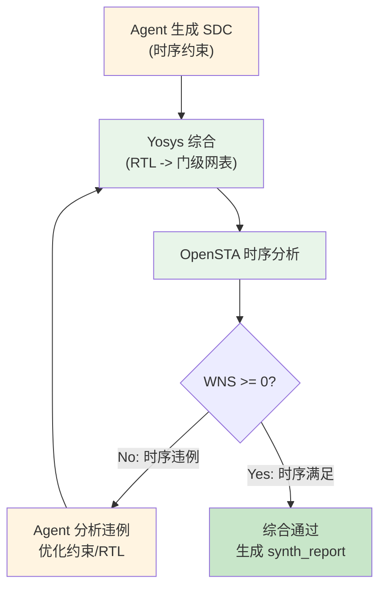

# 第 10 章：Agent 驱动的逻辑综合

> **本章核心**：Agent 自动编写 SDC 时序约束、运行 Yosys 综合、分析时序报告、迭代优化到时序收敛。人审查关键决策点，Agent 处理重复性迭代工作。

---

## 10.1 Agent 综合流程

逻辑综合是将 RTL 代码转换为门级网表的过程，需要在目标工艺库的约束下优化面积、时序和功耗。在 Babel 的 AI 原生流程中，Agent 自动驱动整个综合迭代：



关键概念解释：

- **WNS（Worst Negative Slack）**：最差时序裕量。WNS >= 0 表示所有时序路径满足约束；WNS < 0 表示存在时序违例。
- **TNS（Total Negative Slack）**：所有违例路径的 slack 总和，反映整体时序质量。
- **SDC（Synopsys Design Constraints）**：标准化的时序约束文件格式，被 Yosys 和 OpenSTA 共同使用。

## 10.2 使用 `/bba-guru-synthesis` 启动综合

### 输入

| 输入项 | 说明 | 示例 |
|--------|------|------|
| RTL 代码 | 已验证的 SystemVerilog | `rtl/designs/NPU_top/rtl/` 下所有 `.sv` 文件 |
| MAS 参考 | 时序约束推导依据 | 时钟频率、关键路径延迟 |
| 工艺库 | Liberty (.lib) 文件 | `libs/asap7/.../asap7sc7p5t_28.lib` |
| ARCH 参考 | 时钟域和复位规划 | `spec/ARCH/clock_reset_spec.md` |

### Agent 工作流

1. **SDC 生成**：从 MAS 和 ARCH 文档中提取时钟频率、IO 延迟、false path 等约束，生成 SDC 文件。
2. **Yosys 综合**：调用 `/bb-invoke-yosys` 执行 RTL 到门级网表的转换。
3. **OpenSTA 分析**：调用 `/bb-invoke-opensta` 对门级网表进行静态时序分析。
4. **迭代优化**：如果 WNS < 0，Agent 分析违例原因，选择优化策略（调整约束或优化 RTL），重新运行综合。

### 输出

Agent 生成两个关键产物：

**综合网表**（如 `netlist_NPU_top_final.v`）：
- 由标准单元（如 AND2x2_ASAP7_75t_L、DFFHQNx1_ASAP7_75t_L 等）构成的门级网表
- 包含 SHA256 哈希用于下游 PD 流程的完整性校验

**综合报告**（`synth_report.json`）：

```json
{
  "design_name": "NPU_top",
  "top_module": "NPU_top",
  "tech_lib": "ASAP7",
  "tech_lib_version": "sc7p5t_28",
  "wns": 0.15,
  "tns": 0.0,
  "timing_verified": true,
  "cdc_clean": true,
  "cell_count": 9034,
  "estimated_gate_count": 50000,
  "chip_area_estimate_um2": 100000,
  "synthesis_tool": "yosys",
  "synthesis_version": "0.35"
}
```

## 10.3 综合基础概念

### 工艺映射（Technology Mapping）

工艺映射是将综合后的通用逻辑门（AND、OR、NOT、DFF 等）替换为目标工艺库中具体标准单元的过程。以 ASAP7 7nm 工艺为例：

| 通用逻辑 | ASAP7 标准单元 | 说明 |
|----------|---------------|------|
| 2 输入 AND | AND2x2_ASAP7_75t_L | 7.5-track, Low VT |
| 2 输入 OR | OR2x2_ASAP7_75t_L | 7.5-track, Low VT |
| 反相器 | INVx1_ASAP7_75t_L | 最小尺寸反相器 |
| 2 输入 XOR | XOR2x1_ASAP7_75t_L | XOR 单元 |
| AOI22 | AOI22x1_ASAP7_75t_L | AND-OR-Invert 复合门 |
| D 触发器 | DFFHQNx1_ASAP7_75t_L | 带 QN 输出的 DFF |
| 带异步复位 DFF | DFFASRHQNx1_ASAP7_75t_L | 异步置位/复位 DFF |

在 NPU_top 项目的实际综合中，技术映射后的单元分布如下：

| 单元类型 | 数量 | 功能 |
|----------|------|------|
| INVx1_ASAP7_75t_L | 3812 | 反相器 |
| AND2x2_ASAP7_75t_L | 1797 | 2 输入与门 |
| OR2x2_ASAP7_75t_L | 1214 | 2 输入或门 |
| AOI22x1_ASAP7_75t_L | 992 | AND-OR-Invert |
| DFFASRHQNx1_ASAP7_75t_L | 990 | 异步置位/复位触发器 |
| XOR2x1_ASAP7_75t_L | 166 | 异或门 |
| DFFHQNx1_ASAP7_75t_L | 63 | 普通触发器 |
| **总计** | **9034** | |

### 时序约束

时序约束定义了电路中信号传播的时间限制。核心约束包括：

- **时钟周期**：决定了电路的最高工作频率
- **Setup Time**：数据必须在时钟沿到来前稳定的最短时间
- **Hold Time**：数据必须在时钟沿到来后保持的最短时间
- **Input/Output Delay**：外部信号到达/离开芯片的延迟

### 面积优化

综合工具在满足时序约束的前提下，尽可能减少面积。常用的面积优化策略：

- **逻辑优化**：消除冗余逻辑、共享公共子表达式
- **寄存器优化**：移除未使用的触发器、合并等价寄存器
- **门级优化**：选择面积更小的标准单元实现相同功能

## 10.4 Yosys 综合工具

### Agent 如何通过 `/bb-invoke-yosys` 调用

Agent 通过 `/bb-invoke-yosys` Skill 调用 Yosys 综合工具。Yosys 是 Babel 项目中使用的开源 RTL 综合工具（版本 0.35+），支持 Verilog/SystemVerilog 输入。

### 综合脚本结构

Agent 生成的 Yosys 综合脚本（`.ys` 文件）通常包含以下步骤：

```tcl
# synth.ys - NPU_top 综合脚本

# 1. 读取设计
read_verilog -sv rtl/designs/NPU_top/rtl/NPU_top/src/NPU_top.sv
read_verilog -sv rtl/designs/NPU_top/rtl/M06/src/M06_ClockManager.sv
# ... 其他模块

# 2. 设置顶层模块
hierarchy -check -top NPU_top

# 3. 高层次综合
proc          # 将 always 块转换为 mux + register
opt           # 优化
fsm           # 状态机提取和优化
opt
memory        # 存储器推断
opt

# 4. 技术映射
techmap       # 将高级构造映射到基本门
opt

# 5. 映射到目标工艺库
dfflibmap -liberty libs/asap7/.../asap7sc7p5t_28.lib
abc -liberty libs/asap7/.../asap7sc7p5t_28.lib

# 6. 清理
clean

# 7. 输出
write_verilog -noattr netlist_NPU_top_final.v
stat -liberty libs/asap7/.../asap7sc7p5t_28.lib
```

### 综合命令详解

Yosys 综合流程由一系列命令组成，每个命令完成特定的转换步骤：

| 命令 | 阶段 | 作用 |
|------|------|------|
| `read_verilog -sv` | 输入 | 读取 SystemVerilog 设计文件 |
| `hierarchy -check -top` | 检查 | 验证模块层次完整性 |
| `proc` | 转换 | 将 `always` 块转换为 mux + register |
| `opt` | 优化 | 消除冗余逻辑、常量传播 |
| `fsm` | 优化 | 状态机提取和编码优化 |
| `memory` | 推断 | 将数组映射到 SRAM 或寄存器堆 |
| `techmap` | 映射 | 将高级构造映射到基本门 |
| `dfflibmap` | 映射 | 将 DFF 映射到工艺库的触发器 |
| `abc` | 映射 | ABC 逻辑优化和工艺映射 |
| `clean` | 清理 | 移除未使用的信号和模块 |
| `write_verilog` | 输出 | 生成门级网表 |
| `stat` | 报告 | 统计面积、单元数等指标 |

### Liberty 库（.lib）

Liberty 文件是标准单元的时序、功耗和面积模型，是综合和时序分析的核心输入。ASAP7 7nm PDK 提供的 Liberty 文件包含：

- **单元功能描述**：每个标准单元的逻辑功能（如 AND2、OR2、DFF 等）
- **时序模型**：单元的传播延迟，以输入转换时间（input transition）和输出负载（output capacitance）为变量的二维查找表
- **功耗模型**：单元的静态漏电功耗和动态开关功耗
- **面积信息**：单元的物理面积（用于面积估算和优化）

### Yosys 可综合性检查

在运行完整综合前，Agent 先进行可综合性检查：

```tcl
# 可综合性预检查
read_verilog -sv design.sv
hierarchy -check -top NPU_top
proc
check            # 检查不可综合的构造
```

如果 `check` 命令报告问题，Agent 会分析错误并修复 RTL 代码，然后重新运行检查。常见的可综合性问题包括：

- 使用 `initial` 块（仅用于仿真）
- 使用 `#delay` 语法
- 使用 `real` 类型变量参与运算
- 敏感列表不完整

## 10.5 SDC 时序约束

### Agent 如何从 MAS 推导约束

Agent 从以下来源推导 SDC 约束：

1. **ARCH clock_reset_spec.md**：时钟频率和时钟域定义
2. **MAS 模块规范**：各模块的时序要求
3. **IO 规范**：外部接口的时序约束

以 NPU_top 项目为例，ARCH 文档定义了三个时钟域：

| 时钟域 | 频率范围 | 模块 | DVFS |
|--------|---------|------|------|
| CLK_SYS | 250-500 MHz | M00-M04, M08-M14 | 支持 |
| CLK_AON | 1 MHz | M05-M07 | 不支持 |
| CLK_IO | 50 MHz | M15-M16 | 不支持 |

### SDC 文件示例

Agent 为 NPU_top 生成的实际 SDC 文件（`NPU_top_250mhz.sdc`）：

```tcl
# TinyStories NPU Timing Constraints
# Target: ASAP7 7nm PDK
# 250 MHz operation (relaxed from original 500 MHz target)

# ---- Clock Definitions ----
# CLK_SYS: 250 MHz (4.0 ns period)
create_clock -name CLK_SYS -period 4.0 [get_ports ext_clk_50MHz]

# CLK_AON: Always-on clock (~1 MHz, 1050 ns period)
create_clock -name CLK_AON -period 1050 [get_ports ext_clk_50MHz]

# ---- Asynchronous Clock Groups ----
set_clock_groups -asynchronous \
    -group [get_clocks CLK_SYS] \
    -group [get_clocks CLK_AON]

# ---- Input/Output Delays ----
set_input_delay -clock CLK_SYS 0.1 [get_ports ext_rst_por_n]
set_input_delay -clock CLK_SYS 0.1 [get_ports pll_lock_ext]
set_output_delay -clock CLK_SYS 0.1 [get_ports pll_pwr_en]
set_output_delay -clock CLK_SYS 0.1 [get_ports irq_compute_done]

# ---- False Paths ----
set_false_path -from [get_ports ext_rst_por_n]

# ---- Multi-cycle Paths ----
# 脉动阵列允许 8 个周期完成计算
set_multicycle_path -setup 8 \
    -to [get_cells -hierarchical -filter "name=~*M00*"]
# Attention Unit 允许 4 个周期
set_multicycle_path -setup 4 \
    -to [get_cells -hierarchical -filter "name=~*M09*"]
# FFN/MatMul 允许 4 个周期
set_multicycle_path -setup 4 \
    -to [get_cells -hierarchical -filter "name=~*M10*"]

# ---- Load & Drive ----
set_load 0.01 [all_outputs]
set_driving_cell -lib_cell INVx1_ASAP7_75t_L -pin Y [all_inputs]

# ---- Uncertainty ----
set_clock_uncertainty 0.05 [all_clocks]
set_max_transition 0.1 [current_design]
```

### 关键 SDC 命令解释

| 命令 | 作用 | 示例说明 |
|------|------|----------|
| `create_clock` | 定义时钟源 | `-period 4.0` 表示 250 MHz |
| `set_clock_groups` | 声明异步时钟关系 | 避免跨域路径被分析为时序路径 |
| `set_input_delay` | 设置输入端口延迟 | 外部信号到达芯片的延迟 |
| `set_output_delay` | 设置输出端口延迟 | 芯片信号到达外部目标的延迟 |
| `set_false_path` | 声明非时序路径 | 异步复位信号不分析时序 |
| `set_multicycle_path` | 允许多周期路径 | 计算单元允许多个周期完成 |
| `set_clock_uncertainty` | 时钟抖动裕量 | 0.05ns 的时钟不确定性 |
| `set_max_transition` | 最大信号转换时间 | 防止过慢的信号边沿 |

值得注意的是，实际项目中 Agent 将 CLK_SYS 从原始的 500 MHz（2.0ns 周期）放宽到 250 MHz（4.0ns 周期），这是因为初版 RTL 的关键路径延迟过长。Agent 在综合报告中记录了原因："WNS violated by ~1.02 ns at 500 MHz, relaxed to 250 MHz to achieve timing closure"。

## 10.6 综合结果分析

### Agent 如何解读报告

综合完成后，Agent 从 Yosys 和 OpenSTA 生成的报告中提取关键指标：

**面积报告**：

| 指标 | 含义 | 审查标准 |
|------|------|----------|
| Cell Count | 标准单元总数 | 与预估门数一致 |
| Estimated Gate Count | 等效门数 | 不超过面积预算 |
| Chip Area Estimate | 估计芯片面积 | 不超过 die area 预算 |

**时序报告**：

| 指标 | 含义 | 通过标准 |
|------|------|----------|
| WNS | 最差时序裕量 | >= 0 |
| TNS | 总违例 slack | = 0（所有路径满足） |
| Critical Path | 关键路径延迟 | < 时钟周期 - setup time |

### 时序违例时的 Agent 策略

当 WNS < 0 时，Agent 采用分层策略：

```mermaid
flowchart TD
    A["WNS < 0"] --> B{违例类型}
    B -->|"Setup violation"| C{关键路径分析}
    B -->|"Hold violation"| D[插入缓冲器]

    C --> E{路径类型}
    E -->|"跨模块长路径"| F[添加流水线寄存器]
    E -->|"组合逻辑过深"| G[逻辑重构/分解]
    E -->|"约束过紧"| H{约束合理?}
    H -->|"Yes"| I[优化 RTL]
    H -->|"No"| J[放宽约束<br/>(需人工审批)]

    D --> K[重新综合]
    F --> K
    G --> K
    I --> K
    J --> K
```

Agent 的优化决策优先级：

1. **首选优化 RTL**：添加流水线寄存器、重构组合逻辑、减少扇出
2. **次选调整约束**：放宽非关键路径的约束、增加 multicycle path
3. **最后考虑降频**：如果 RTL 优化和约束调整都无法收敛，建议降低时钟频率

以 NPU_top 的实际案例为例，Agent 发现 500 MHz 目标下关键路径延迟远超时钟周期，因此采取了以下策略：
- 将 CLK_SYS 频率从 500 MHz 放宽到 250 MHz
- 为计算单元（M00、M09、M10）设置 multicycle path
- 将 CLK_AON 周期从 1000ns 放宽到 1050ns

### ASAP7 7nm 工艺库特性

Babel 项目使用 ASAP7（Arizona State University 7nm Predictive PDK）预测性 PDK，这是一个学术级 7nm 工艺库。关键特性：

| 参数 | 值 | 说明 |
|------|-----|------|
| 工艺节点 | 7nm | 预测性 FinFET |
| 标准单元库 | asap7sc6t_26, asap7sc7p5t_27/28 | 6-track 和 7.5-track |
| 阈值电压 | LVT / RVT / HVT / SLVT | 多 VT 优化 |
| 行高（7.5t） | 0.27 um | 标准单元行高 |
| 金属层 | M1-M7 | 7 层金属 |
| 通孔层 | V1-V6 | 6 层通孔 |

ASAP7 库提供了多种 VT（阈值电压）选项：
- **SLVT（Super Low VT）**：最快但漏电最大，用于关键路径
- **LVT（Low VT）**：较快速度，较高漏电
- **RVT（Regular VT）**：平衡速度和漏电
- **HVT（High VT）**：最慢但漏电最小，用于非关键路径

## 10.7 审查综合结果

### 时序报告审查要点

| 审查项 | 要点 | 红旗信号 |
|--------|------|----------|
| WNS 值 | 是否 >= 0 | WNS 为负值，或裕量极小（< 0.05ns） |
| 关键路径 | 路径是否合理 | 关键路径穿越不相关的模块 |
| Multicycle Path | 设置是否合理 | 过多的 multicycle path 可能掩盖设计问题 |
| Clock Skew | 时钟偏斜是否在预算内 | Skew 超过 clock uncertainty 设定值 |
| 寄存器到寄存器路径 | 最长路径延迟 | 接近或超过时钟周期的路径 |

### 面积合理性判断

| 审查项 | 要点 | 参考 |
|--------|------|------|
| 单元总数 | 与设计复杂度匹配 | NPU_top: ~9000 单元（初版） |
| 触发器比例 | DFF 占总单元比例 | 通常 10-20%，过高说明流水线过深 |
| 反相器比例 | INV 占总单元比例 | 通常 30-50%，过高可能有优化空间 |
| 面积利用率 | 单元面积 / Core 面积 | 通常 60-80%，过高会导致布线困难 |

### 综合报告中的红旗信号

以下信号出现时，需要工程师特别关注：

1. **Latch 推断警告**：说明组合逻辑中存在锁存器，通常是 `always_comb` 中缺少 default 赋值
2. **未优化常量**：某些信号被综合为常量 0 或 1，可能是逻辑错误
3. **扇出过大**：单个信号驱动过多负载（> 32），需要插入缓冲树
4. **跨时钟域路径**：综合工具可能将 CDC 路径当作普通时序路径分析，需要 false_path 或 multicycle_path 约束

---

## 本章小结

1. **SDC 驱动综合**：Agent 从 MAS 和 ARCH 文档自动推导 SDC 时序约束，驱动 Yosys 综合和 OpenSTA 时序分析。
2. **自动迭代优化**：综合不是一次性过程，Agent 在时序违例时自动分析原因、选择优化策略、重新综合，直到 WNS >= 0。
3. **ASAP7 7nm 工艺**：Babel 使用 ASAP7 预测性 PDK，包含 7.5-track 标准单元和多 VT 优化选项。
4. **时序约束是艺术与科学的结合**：Agent 负责约束的生成和调整，但关键决策（如是否降频、是否添加流水线）需要工程师审批。
5. **审查聚焦于合理性**：审查综合结果时关注关键路径是否合理、面积是否在预算内、是否存在红旗信号。
