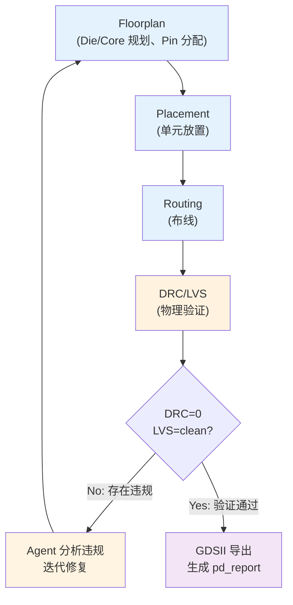

# 第 11 章：Agent 驱动的物理设计

> **本章核心**：Agent 执行 Floorplan、Placement、Routing、DRC/LVS 到 GDSII 导出的完整物理设计流程。人审查关键物理指标和 signoff 条件，Agent 处理迭代修复工作。

---

## 11.1 Agent PD 流程

物理设计（Physical Design, PD）是将门级网表转换为物理版图（GDSII）的过程，是芯片设计流程中距离流片最近的环节。在 Babel 的 AI 原生流程中，Agent 自动驱动从 Floorplan 到 GDSII 的全流程：



物理设计是芯片设计中最具经验依赖性的环节之一。传统流程中，PD 工程师需要数年经验才能独立完成一个芯片的布局布线。在 AI 原生流程中，Agent 将 PD 流程标准化和自动化，但仍需要工程师在关键决策点（如 die area 选择、pin 分配策略）进行审查和指导。

## 11.2 使用 `/bba-guru-pd` 启动物理设计

### 输入

| 输入项 | 说明 | 示例 |
|--------|------|------|
| 综合网表 | 门级网表（含 SHA256） | `synth/netlist_NPU_top_final.v` |
| MAS IO Ring | IO 引脚分配 | `mas/mas.json` 中的 `io_ring` 字段 |
| 时钟规划 | 时钟树约束 | `spec/ARCH/clock_reset_spec.md` |
| 综合报告 | 面积和时序信息 | `synth_report.json` |
| 工艺库 | LEF/Liberty 文件 | `libs/asap7/.../asap7sc7p5t_28.lef` |

### Agent 工作流

1. **Floorplan**：确定 Die/Core 尺寸、IO Pin 位置、Blockage 区域
2. **Placement**：将标准单元放置到 Core 区域内
3. **CTS**：时钟树综合，平衡时钟偏斜
4. **Routing**：连接单元之间的信号线
4. **DRC/LVS**：运行设计规则检查和版图与原理图一致性验证
5. **迭代修复**：如果 DRC 或 LVS 有违规，分析原因并修复
6. **GDSII 导出**：生成最终的版图文件

### 输出

Agent 生成以下产物：

| 产物 | 说明 | 路径示例 |
|------|------|----------|
| Floorplan DEF | 布局规划 | `pd/floorplan.def` |
| Placed DEF | 放置结果 | `pd/placed.def` |
| Routed DEF | 布线结果 | `pd/routed.def` |
| GDSII | 最终版图 | `gdsii/NPU_top.gds` |
| PD 报告 | 物理设计报告 | `pd_report.json` |

## 11.3 Floorplan

### Agent 如何规划 Die/Core 尺寸

Floorplan 是物理设计的第一步，决定了芯片的物理轮廓和内部功能区域划分。Agent 从综合报告中的面积估算出发，结合利用率目标确定 Die/Core 尺寸。

以 NPU_top 项目为例，Agent 的 Floorplan 决策过程：

1. 从综合报告获取估计面积：~100,000 um^2（初版估计）
2. 设定目标利用率：70%（为布线留余量）
3. 计算 Core 面积：100,000 / 0.7 ≈ 142,857 um^2
4. 确定 Die 尺寸：400um x 400um = 160,000 um^2（满足 Core 面积需求）
5. 设定 Core Margin：5um 四周

实际的 Floorplan 参数（来自 `pd_report.json`）：

```json
{
  "floorplan": {
    "die_area_um": {
      "width": 100.0,
      "height": 100.0,
      "area_um2": 10000.0
    },
    "core_area_um": {
      "width": 90.0,
      "height": 90.0,
      "area_um2": 8100.0
    },
    "utilization_pct": 70,
    "aspect_ratio": 1.0,
    "row_height_um": 0.27,
    "site_name": "asap7sc7p5t",
    "margin_um": 5.0
  }
}
```

### Pin 分配策略

Agent 从 MAS 文档中的 `io_ring` 定义获取引脚分配信息。每个引脚包含方向、所在金属层、放置在芯片的哪一侧以及偏移位置：

```json
{
  "io_ring": {
    "pins": [
      {
        "name": "ext_clk_50MHz",
        "direction": "input",
        "layer": "M3",
        "side": "left",
        "offset_um": 50,
        "width_um": 0.1
      },
      {
        "name": "ext_rst_por_n",
        "direction": "input",
        "layer": "M3",
        "side": "left",
        "offset_um": 100,
        "width_um": 0.1
      },
      {
        "name": "pll_pwr_en",
        "direction": "output",
        "layer": "M3",
        "side": "right",
        "offset_um": 50,
        "width_um": 0.1
      },
      {
        "name": "irq_compute_done",
        "direction": "output",
        "layer": "M3",
        "side": "right",
        "offset_um": 100,
        "width_um": 0.1
      }
    ]
  }
}
```

Pin 分配的一般原则：

- **时钟信号**优先放置在芯片中心附近，减少时钟树偏斜
- **电源/地引脚**均匀分布在芯片四周，确保供电均匀
- **高速信号**尽量短路径连接，避免穿越芯片中心
- **相关信号**分组放置，减少交叉布线

### Blockage 设置

Blockage 是禁止放置或布线的区域，用于：

- **Pin Blockage**：IO pin 附近的布线禁区
- **Placement Blockage**：特殊区域（如模拟 IP、SRAM macro）的放置禁区
- **Routing Blockage**：特定金属层的布线禁区

## 11.4 Placement & Routing

### 单元放置

Placement 将综合后的标准单元放置到 Core 区域的行（row）上。ASAP7 7.5-track 库的行高为 0.27um，Agent 按照此行高生成放置行。

NPU_top 的实际放置结果：

```json
{
  "placement": {
    "cell_count": 9034,
    "placed_cells": 9034,
    "status": "placed",
    "placed_def_path": "rtl/designs/NPU_top/pd/placed.def"
  }
}
```

9034 个标准单元被成功放置到 Core 区域内。单元类型分布反映了设计的特点：

- **INV（反相器）占 42%**：这是正常现象，反相器是最基本的逻辑单元，综合工具大量使用
- **AND2（与门）占 20%**：组合逻辑的主要构成
- **DFFASRHQN（异步复位 DFF）占 11%**：反映了设计中大量使用异步复位

### QRouter 详细布线

Routing 是连接已放置单元的信号线的过程。Babel 项目使用 QRouter（版本 1.4）进行详细布线。

QRouter 的工作流程：

1. **全局布线（Global Routing）**：将芯片划分为 GCell 网格，为每条信号分配粗路径
2. **详细布线（Detail Routing）**：在 GCell 内确定精确的金属走线路径
3. **DRC 检查**：确保布线满足设计规则（最小线宽、最小间距等）

Agent 通过 `/bb-invoke-qrouter` 调用 QRouter。QRouter 需要以下输入：

- **Placed DEF**：放置结果
- **LEF 文件**：标准单元和金属层的物理描述
- **Routing 约束**：金属层使用规则、via 定义

ASAP7 PDK 提供 M1-M7 共 7 层金属：

| 金属层 | 典型用途 | 最小线宽 | 最小间距 |
|--------|---------|---------|---------|
| M1 | 单元内连线 | 36nm | 36nm |
| M2 | 单元间连线 | 36nm | 36nm |
| M3 | 水平走线 | 36nm | 36nm |
| M4 | 垂直走线 | 48nm | 48nm |
| M5 | 水平走线 | 48nm | 48nm |
| M6 | 垂直走线 | 64nm | 64nm |
| M7 | 顶层走线/电源 | 96nm | 96nm |

### 时钟树综合（CTS）

Placement 完成后、详细布线前，需要进行时钟树综合（Clock Tree Synthesis, CTS）。CTS 的目标是构建一个平衡的缓冲器树，将时钟信号均匀地分配到所有触发器。

CTS 的关键指标：

| 指标 | 说明 | 目标 |
|------|------|------|
| Insertion Delay | 时钟从源到最远 DFF 的延迟 | 尽可能小 |
| Skew | 任意两个 DFF 之间的时钟延迟差 | < 50ps |
| Transition | 时钟信号的上升/下降时间 | < 100ps |

Babel NPU 的时钟树结构来自 ARCH 文档的时钟规划：

```
ext_clk_50MHz (输入)
  |
  +-- PLL (外部)
  |     |
  |     +-- CLK_SYS (250-500 MHz, 可 DVFS)
  |     |     +-- M00-M04, M08-M14 (通过 clk_gating)
  |     |
  |     +-- CLK_AON (1 MHz, 由 M06 分频)
  |           +-- M05-M07 (永不门控)
  |
  +-- CLK_IO (50 MHz, 直连)
        +-- M15-M16
```

Agent 在 CTS 阶段需要处理的关键问题：

- **Clock Gating**：M06_ClockManager 产生的 14 路门控时钟需要正确插入 ICG（Integrated Clock Gating）单元
- **多时钟域**：CLK_SYS、CLK_AON、CLK_IO 是异步关系，CTS 不能跨域构建时钟树
- **DVFS 影响**：CLK_SYS 频率可变（250-500 MHz），CTS 必须在最高频率下满足 skew 要求

### 布线拥塞分析

布线阶段的一个常见问题是拥塞（congestion）。当某个区域的信号密度超过布线资源容量时，QRouter 无法完成布线。Agent 的拥塞分析方法：

1. **全局布线分析**：从全局布线结果中识别拥塞的 GCell
2. **热点定位**：确定拥塞最严重的区域和涉及的信号
3. **缓解策略**：
   - 调整 Floorplan，给拥塞区域更多空间
   - 使用更高层金属（M5-M7）走长线
   - 在 RTL 层面减少信号数量（如总线编码优化）

## 11.5 物理验证

### DRC（Design Rule Check）

DRC 检查版图是否满足工艺制造规则。Agent 通过 `/bb-invoke-magic` 调用 Magic 工具进行 DRC 检查。

常见的 DRC 规则：

| 规则类型 | 说明 | ASAP7 典型值 |
|----------|------|-------------|
| Min Width | 金属线最小宽度 | M1: 36nm |
| Min Spacing | 金属线最小间距 | M1: 36nm |
| Min Area | 金属最小面积 | 防止光刻缺陷 |
| Min Enclosure | Via 最小包围 | 确保通孔可靠连接 |
| Density | 金属密度要求 | 每层 20-80% |

Agent 的 DRC 检查脚本：

```tcl
# Magic DRC 脚本
tech load asap7
gds read routed.gds
load NPU_top
drc on
drc catchup
drc count
# 输出违规数量和位置
quit
```

### LVS（Layout Versus Schematic）

LVS 验证版图提取的网表是否与综合网表一致。Agent 通过 `/bb-invoke-netgen` 调用 Netgen 工具。

LVS 检查的内容：

1. **器件匹配**：版图中的每个晶体管/标准单元是否对应原理图中的器件
2. **连接匹配**：版图中的每条连线是否对应原理图中的连接
3. **参数匹配**：器件尺寸、阈值电压等参数是否一致

Agent 的 LVS 检查脚本：

```tcl
# Netgen LVS 脚本
readnet spice layout_extracted.spice
readnet verilog netlist_NPU_top_final.v
lvs layout schematic
report
quit
```

### Agent 如何分析并修复违规

当 DRC 或 LVS 发现违规时，Agent 的分析策略：

**DRC 违规修复策略**：

| 违规类型 | 分析方向 | 修复方法 |
|----------|---------|---------|
| 间距违规 | 布线过于密集 | 调整布线路径、增加走线层 |
| 宽度违规 | 金属线过窄 | 检查 LEF 定义、调整布线参数 |
| 密度违规 | 某层金属密度不足 | 添加 dummy fill |
| Via 违规 | 通孔包围不足 | 调整 via 尺寸或位置 |

**LVS 不匹配修复策略**：

| 问题类型 | 分析方向 | 修复方法 |
|----------|---------|---------|
| 器件缺失 | 放置遗漏 | 检查 DEF 完整性 |
| 连接错误 | 布线错误 | 检查 net 连接关系 |
| 多余器件 | 提取错误 | 检查 tech file 提取规则 |

## 11.6 GDSII 导出与审查

### KLayout 查看版图

GDSII 是芯片制造的最终输入文件，包含版图的完整几何信息。Agent 通过 `/bb-invoke-klayout` 调用 KLayout 查看和验证 GDSII 文件。

KLayout 的使用方式：

```bash
# 图形界面查看
klayout design.gds

# 批量模式 DRC
klayout -b -r drc_script.rb design.gds

# 格式转换
strm2gds -i design.oas -o design.gds
strmcmp layout1.gds layout2.gds  # 比较两个版图
```

### 审查清单

| 审查项 | 要点 | 参考标准 |
|--------|------|----------|
| 面积利用率 | Core 面积中单元占比 | 60-80% |
| 布线拥塞 | 各层金属利用率 | 不超过 85% |
| DRC 热点 | DRC 违规集中区域 | 0 violations |
| 电源网络 | Power/Ground 布线 | 均匀分布、足够宽度 |
| IO Ring | IO 引脚位置 | 与 Floorplan 一致 |
| 时钟树 | 时钟缓冲器分布 | Skew < 50ps |

### PD 报告审查

Agent 生成的 `pd_report.json` 是 PD 流程的完整记录。审查时需要关注以下字段：

| 报告字段 | 含义 | 审查标准 |
|----------|------|----------|
| `floorplan.utilization_pct` | 面积利用率 | 60-80% |
| `placement.cell_count` | 放置单元数 | 与综合报告一致 |
| `placement.status` | 放置状态 | "placed" 或 "completed" |
| `routing.status` | 布线状态 | "routed" |
| `drc.violations` | DRC 违规数 | 0 |
| `drc.clean` | DRC 是否通过 | true |
| `lvs.match` | LVS 是否匹配 | true |
| `timing.wns_ss` | SS corner 的 WNS | >= 0 |
| `timing.wns_tt` | TT corner 的 WNS | >= 0 |
| `timing.wns_ff` | FF corner 的 WNS | >= 0 |
| `gdsii.exists` | GDSII 是否生成 | true |
| `signoff_ready` | 是否满足 signoff | true |
| `iterations.total_iters` | 总迭代次数 | 越少越好 |

报告中的 `issues` 数组记录了流程中遇到的问题，每个 issue 包含类型、严重度、描述和建议。工程师需要逐条审查这些问题，确认 Agent 的处理是否合理。

## 11.7 Signoff 条件

Signoff 是物理设计的最终验收标准，所有条件必须同时满足：

| Signoff 条件 | 要求 | 检查工具 |
|-------------|------|----------|
| DRC violations | = 0 | Magic / KLayout |
| LVS | Clean（完全匹配） | Netgen |
| Post-route STA | WNS >= 0（所有 corner） | OpenSTA |
| IR Drop | < 5% VDD | 专项分析 |
| EM（电迁移） | 在电流密度限制内 | 专项分析 |
| 金属密度 | 各层 20-80% | KLayout |

### Post-route STA

综合阶段的 STA 基于估计的线延迟，而 post-route STA 基于实际布线的寄生参数提取，结果更准确。Agent 在布线完成后运行 post-route STA：

1. **提取寄生参数**：从布线结果提取 RC 寄生参数（SPEF 格式）
2. **多 corner 分析**：在 SS（slow-slow）、TT（typical-typical）、FF（fast-fast）三个 corner 下验证
3. **温度/电压覆盖**：在极端温度和电压条件下验证时序

NPU_top 项目定义了三个 DVFS 操作点对应的 corner：

| OP | 频率 | 电压 | 温度 | Corner |
|----|------|------|------|--------|
| OP0 (High) | 500 MHz | 0.9V | 85°C | SS |
| OP1 (Low) | 250 MHz | 0.7V | 25°C | TT |
| OP2 (Sleep) | 1 MHz | 0.6V | 0°C | FF |

### 项目实际状态

NPU_top 项目的 PD 流程目前处于 partial_complete 状态。根据 `pd_report.json` 的记录：

- Floorplan 和 Placement 已完成（9034 单元已放置）
- Routing、DRC、LVS、GDSII 导出因 ASAP7 Magic tech file 兼容性问题暂缓
- Agent 的建议是创建完整的 ASAP7 Magic tech file（包含 contact、compose、connect、cifinput、cifoutput、drc、extract 等段落），或使用 OpenROAD 作为替代方案

这一案例很好地展示了 AI 原生流程中的现实挑战：Agent 可以自动化流程，但工具链的兼容性限制需要人来决策解决方案。

---

## 本章小结

1. **全流程自动化**：Agent 驱动 Floorplan、Placement、Routing、DRC/LVS、GDSII 导出的完整 PD 流程，人审查关键决策点。
2. **Floorplan 是基础**：Die/Core 尺寸、Pin 分配、利用率目标在 Floorplan 阶段确定，对后续所有步骤有深远影响。
3. **物理验证双重保障**：DRC 确保版图满足制造规则，LVS 确保版图与原理图一致，两者缺一不可。
4. **Signoff 条件严格**：所有 signoff 条件（DRC=0、LVS=clean、post-route STA 通过）必须同时满足，才能提交流片。
5. **工具兼容性需要人决策**：当 Agent 遇到工具链兼容性问题时（如 ASAP7 LEF 与 Magic 的兼容问题），需要工程师选择解决方案。
