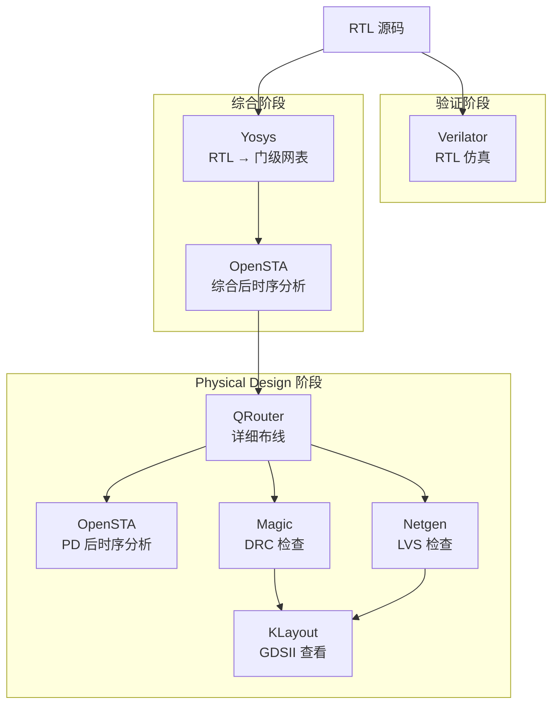

# 第 12 章：用 Claude Code 搭建开源 EDA 工具链

> **本章核心**：工具链安装、配置、验证全部通过 Claude Code 完成，展示 AI 原生工作流。
>
> **前置条件**：已安装 Claude Code（参见第 2 章），具备 Linux 命令行基础。
>
> **预计耗时**：约 60 分钟（含编译等待时间）。

---

## 12.1 工具链总览

Babel 项目采用全开源 EDA 工具链覆盖芯片设计的完整流程。下表列出 7 个核心工具及其在流程中的角色：

| 工具 | 版本 | 功能 | 官网 | 安装难度 |
|------|------|------|------|----------|
| Yosys | 0.35 | 逻辑综合（RTL → 门级网表） | https://yosyshq.net/yosys/ | 低 |
| OpenSTA | 2.2.0 | 静态时序分析（STA） | https://github.com/The-OpenROAD-Project/OpenSTA | 中 |
| Magic | 8.3.641 | 版图编辑 + DRC/LVS 检查 | http://opencircuitdesign.com/magic/ | 中 |
| Netgen | 1.5 | LVS 网表对比 | http://opencircuitdesign.com/netgen/ | 低 |
| QRouter | 1.4 | 详细布线（Detailed Routing） | http://opencircuitdesign.com/qrouter/ | 低 |
| KLayout | 0.30.8 | GDSII 查看与编辑 | https://www.klayout.de/ | 低 |
| Verilator | latest | RTL 仿真器（Simulation） | https://www.veripool.org/verilator/ | 中 |

所有工具统一安装到 `~/wrk/eda_opensources/install/` 目录下，通过一个环境脚本 `eda_env.sh` 集中管理 PATH。

### 工具在 Babel 流程中的位置



每个工具专注流程中的一个环节，通过标准文件格式（Verilog 网表、LEF/DEF、GDSII、Liberty）串联成完整的设计链路。

---

## 12.2 使用 Claude Code 安装工具链

传统方式下，手动编译安装 7 个 EDA 工具需要反复查阅文档、解决依赖冲突、调整编译参数，整个过程容易出错且耗时。使用 Claude Code，只需给出目标，Agent 会自动完成环境检测、依赖分析、源码编译、安装验证的全流程。

### Agent 安装工作流

Claude Code 执行安装时遵循以下步骤：

1. **分析环境**：检测操作系统版本、已安装的编译工具链（GCC、Make、CMake）、磁盘空间是否充足
2. **规划安装顺序**：根据工具间依赖关系排序（例如 Magic 依赖 X11 开发库，OpenSTA 依赖 Tcl/SWIG）
3. **下载源码**：从官方仓库 clone 或下载指定版本的源码包
4. **编译安装**：逐个工具执行 configure、make、make install，使用 `make -j$(nproc)` 并行编译加速
5. **验证结果**：检查二进制文件是否生成，运行版本命令确认安装成功

### 示例：安装 Yosys

在 Claude Code 中输入：

```
请安装 Yosys 0.35 到 ~/wrk/eda_opensources/install/yosys
```

Claude Code 的执行过程：

```bash
# 1. 检测环境
gcc --version          # 确认 GCC >= 9
make --version         # 确认 Make 可用
df -h ~/wrk            # 确认磁盘空间 >= 5GB

# 2. 安装依赖（以 Ubuntu/Debian 为例）
sudo apt install -y build-essential clang bison flex \
    libreadline-dev gawk tcl-dev libffi-dev git \
    graphviz xdot pkg-config python3 libboost-system-dev \
    libboost-python-dev libboost-filesystem-dev zlib1g-dev

# 3. 下载源码
cd ~/wrk/eda_opensources
git clone https://github.com/YosysHQ/yosys.git
cd yosys
git checkout v0.35

# 4. 编译安装
make config-gcc
make -j$(nproc)
make install PREFIX=$HOME/wrk/eda_opensources/install/yosys

# 5. 验证
~/wrk/eda_opensources/install/yosys/bin/yosys --version
# 输出：Yosys 0.35
```

### 示例：安装 Magic

```
请安装 Magic 8.3.641
```

Claude Code 会特别注意 X11 依赖：

```bash
# 安装 X11 开发库
sudo apt install -y libx11-dev libcairo2-dev

# 下载并编译
cd ~/wrk/eda_opensources
git clone https://github.com/RTimothyEdwards/magic.git
cd magic
git checkout 8.3.641

./configure --prefix=$HOME/wrk/eda_opensources/install/magic
make -j$(nproc)
make install
```

### 并行编译技巧

对于大型工具（Yosys、Verilator），编译时间可能较长。Claude Code 会自动使用并行编译：

```bash
# 查看 CPU 核心数
nproc
# 假设输出 8

# 使用全部核心编译
make -j8

# 或者保留 1-2 个核心给其他任务
make -j6
```

> **提示**：完整编译工具链可能需要 1-2 小时（取决于机器性能）。可以在对话中说"在后台运行编译，完成后通知我"，Agent 会将编译任务放在后台执行。

---

## 12.3 使用 Claude Code 配置环境

7 个工具安装完成后，需要统一配置环境变量。Claude Code 会自动生成 `eda_env.sh` 脚本。

### 环境配置脚本

让 Claude Code 生成配置：

```
请为已安装的 7 个 EDA 工具生成环境配置脚本 ~/wrk/eda_opensources/eda_env.sh
```

生成的 `eda_env.sh` 内容：

```bash
#!/bin/bash
# Babel 开源 EDA 工具链环境配置
# 使用方式：source ~/wrk/eda_opensources/eda_env.sh

EDA_ROOT=$HOME/wrk/eda_opensources/install

# Yosys - 逻辑综合
export PATH=$EDA_ROOT/yosys/bin:$PATH
export LD_LIBRARY_PATH=$EDA_ROOT/yosys/lib:$LD_LIBRARY_PATH
export LD_LIBRARY_PATH=$EDA_ROOT/yosys/share/yosys:$LD_LIBRARY_PATH

# OpenSTA - 静态时序分析
export PATH=$EDA_ROOT/OpenSTA/bin:$PATH

# Magic - 版图编辑 + DRC/LVS
export PATH=$EDA_ROOT/magic/bin:$PATH
export MAGIC_HOME=$EDA_ROOT/magic

# Netgen - LVS 检查
export PATH=$EDA_ROOT/netgen/bin:$PATH

# QRouter - 详细布线
export PATH=$EDA_ROOT/qrouter/bin:$PATH

# KLayout - GDSII 查看
export PATH=$EDA_ROOT/klayout:$PATH

# Verilator - 仿真器
export PATH=$EDA_ROOT/verilator/bin:$PATH
export VERILATOR_ROOT=$EDA_ROOT/verilator
export LD_LIBRARY_PATH=$EDA_ROOT/verilator/lib:$LD_LIBRARY_PATH

# 技术库路径（ASAP7 PDK）
export PDK_ROOT=$HOME/wrk/Babel/libs
export ASAP7_ROOT=$PDK_ROOT/asap7

echo "EDA 工具链环境已加载"
echo "  Yosys:      $(yosys --version 2>/dev/null || echo '未找到')"
echo "  OpenSTA:    $(sta -version 2>/dev/null || echo '未找到')"
echo "  Magic:      $(magic --version 2>/dev/null || echo '未找到')"
echo "  Verilator:  $(verilator --version 2>/dev/null || echo '未找到')"
```

### 加载与验证

```bash
# 加载环境
source ~/wrk/eda_opensources/eda_env.sh

# 验证各工具路径
which yosys        # 预期：~/wrk/eda_opensources/install/yosys/bin/yosys
which sta          # 预期：~/wrk/eda_opensources/install/OpenSTA/bin/sta
which magic        # 预期：~/wrk/eda_opensources/install/magic/bin/magic
which netgen       # 预期：~/wrk/eda_opensources/install/netgen/bin/netgen
which qrouter      # 预期：~/wrk/eda_opensources/install/qrouter/bin/qrouter
which verilator    # 预期：~/wrk/eda_opensources/install/verilator/bin/verilator
```

### 将环境配置集成到 Shell

```
请将 eda_env.sh 集成到我的 ~/.bashrc 中，使用条件判断确保文件存在才加载。
```

Agent 会在 `~/.bashrc` 末尾添加：

```bash
# 开源 EDA 工具链
if [ -f ~/wrk/eda_opensources/eda_env.sh ]; then
    source ~/wrk/eda_opensources/eda_env.sh
fi
```

---

## 12.4 通过 Claude Code 验证安装

安装和配置完成后，让 Claude Code 执行全面的 smoke test，确认每个工具可正常运行。

### Smoke Test

```
请验证所有 EDA 工具的安装状态，生成验证报告
```

Claude Code 依次执行以下检查：

```bash
# 1. Yosys 版本检查
yosys --version
# 预期输出：Yosys 0.35

# 2. OpenSTA 版本检查
sta -version
# 预期输出：OpenSTA 2.2.0

# 3. Magic 版本检查（无 GUI 模式）
magic -dnull -noconsole <<EOF
version
quit
EOF
# 预期输出：Magic 8.3 revision ...

# 4. Netgen 版本检查
netgen -batch <<EOF
version
quit
EOF

# 5. QRouter 版本检查
qrouter --version

# 6. KLayout 版本检查
klayout -v

# 7. Verilator 版本检查
verilator --version
# 预期输出：Verilator 5.x ...
```

### 功能级 Smoke Test

版本正确只代表二进制文件可运行，还需要功能级验证。Agent 会自动生成测试文件并执行：

```bash
# Yosys 功能验证：综合一个最小模块
cat > /tmp/smoke_counter.v <<'VERILOG'
module counter(input clk, input rst, output reg [3:0] q);
  always @(posedge clk or posedge rst)
    if (rst) q <= 0; else q <= q + 1;
endmodule
VERILOG

yosys -p "read_verilog /tmp/smoke_counter.v; synth -top counter; stat"
# 预期：输出面积统计（DFF、逻辑门数量），无 ERROR
```

```bash
# Verilator 功能验证：lint 检查
verilator --lint-only /tmp/smoke_counter.v
# 预期：无 warning，退出码 0
```

### 验证报告

Claude Code 汇总结果，生成如下表格：

| 工具 | 状态 | 版本 | 安装路径 |
|------|------|------|----------|
| Yosys | 通过 | 0.35 | `~/wrk/.../install/yosys` |
| OpenSTA | 通过 | 2.2.0 | `~/wrk/.../install/OpenSTA` |
| Magic | 通过 | 8.3.641 | `~/wrk/.../install/magic` |
| Netgen | 通过 | 1.5 | `~/wrk/.../install/netgen` |
| QRouter | 通过 | 1.4 | `~/wrk/.../install/qrouter` |
| KLayout | 通过 | 0.30.8 | `~/wrk/.../install/klayout` |
| Verilator | 通过 | 5.x | `~/wrk/.../install/verilator` |

如果某个工具验证失败，Claude Code 会定位原因（PATH 未生效、依赖库缺失、编译不完整等）并给出修复建议。

---

## 12.5 各工具快速上手

安装验证通过后，通过以下 Hello World 示例快速体验每个工具的核心功能。

### Yosys：综合一个 4-bit 计数器

准备 RTL 源码 `counter.v`：

```verilog
// counter.v - 4-bit 计数器
module counter (
    input  wire       clk,
    input  wire       rst,
    output reg  [3:0] count
);
    always @(posedge clk or posedge rst)
        if (rst)
            count <= 4'd0;
        else
            count <= count + 4'd1;
endmodule
```

编写综合脚本 `synth.tcl`：

```tcl
# synth.tcl - Yosys 综合脚本
read_verilog counter.v
synth -top counter

# 使用 ASAP7 工艺库映射（Babel 项目中已提供）
# abc -liberty $::env(ASAP7_ROOT)/asap7sc6t_26.lib

# 输出综合后网表
write_verilog counter_netlist.v

# 生成综合报告
stat
```

执行综合：

```bash
source ~/wrk/eda_opensources/eda_env.sh
yosys synth.tcl
```

Yosys 会输出资源使用统计（触发器数量、LUT 数量等），并生成门级网表 `counter_netlist.v`。

### Verilator：仿真计数器

编写 testbench `tb_counter.v`：

```verilog
// tb_counter.v - 计数器测试平台
module tb_counter;
    reg        clk;
    reg        rst;
    wire [3:0] count;

    counter uut (
        .clk(clk),
        .rst(rst),
        .count(count)
    );

    // 时钟生成：周期 10ns
    initial begin
        clk = 0;
        forever #5 clk = ~clk;
    end

    // 激励序列
    initial begin
        $dumpfile("trace.vcd");
        $dumpvars(0, tb_counter);

        rst = 1;
        #12 rst = 0;    // 复位 12ns 后释放
        #200 $finish;    // 运行 200ns 后结束
    end

    // 监控输出
    always @(posedge clk)
        $display("Time=%0t rst=%b count=%d", $time, rst, count);
endmodule
```

编译并运行仿真：

```bash
# 编译（生成 C++ 仿真模型）
verilator --cc --exe --trace --build \
    -j 4 \
    tb_counter.v counter.v \
    --top-module tb_counter

# 运行仿真
./obj_dir/Vtb_counter

# 查看波形（需要 GTKWave 或 Surfer）
gtkwave trace.vcd &
```

波形窗口中可以观察到计数器从 0 开始递增的过程，验证了 RTL 设计的逻辑正确性。

### OpenSTA：对综合后网表做时序分析

编写 STA 脚本 `sta.tcl`：

```tcl
# sta.tcl - OpenSTA 时序分析脚本
read_liberty asap7.lib
read_verilog counter_netlist.v
link_design counter

# 定义时钟约束：周期 2.0ns（500MHz）
create_clock -period 2.0 -name clk [get_ports clk]

# 设置输入延迟和输出延迟
set_input_delay  -clock clk -max 0.5 [all_inputs]
set_output_delay -clock clk -max 0.5 [all_outputs]

# 报告时序检查结果
report_checks -path_delay max
report_checks -path_delay min

# 报告设计面积
report_design_area
```

执行时序分析：

```bash
sta sta.tcl
```

OpenSTA 会输出每条时序路径的 slack 值。正 slack 表示时序满足约束，负 slack 表示违例（violation），需要优化设计或放宽时钟约束。

### Magic：查看版图与 DRC 检查

如果已有 GDSII 文件，可以直接用 Magic 打开查看：

```bash
# 使用 X11 图形界面打开
magic -d X11 counter.gds
```

在无图形界面的服务器上，使用 batch 模式执行 DRC 检查：

```bash
# 无头模式下执行 DRC 检查
magic -dnull -noconsole <<EOF
gds read counter.gds
load counter
drc check
drc count
quit
EOF
```

DRC（Design Rule Check）会检查版图是否违反工艺设计规则，如最小线宽、最小间距等。

### KLayout：查看和编辑 GDSII

KLayout 提供现代化的图形界面，适合查看复杂版图：

```bash
# 打开 GDSII 文件
klayout counter.gds

# 命令行模式下运行 DRC 脚本
klayout -b -r drc_script.drc counter.gds
```

---

## 12.6 常见安装问题排查

以下是安装和使用过程中常见的问题及其解决方案：

| 问题 | 原因 | 解决方案 |
|------|------|----------|
| `command not found: yosys` | PATH 未设置 | 执行 `source ~/wrk/eda_opensources/eda_env.sh` |
| `libtcl.so: cannot open` | 缺少 Tcl 开发库 | `sudo apt install tcl-dev`（Debian/Ubuntu）或 `sudo dnf install tcl-devel`（RHEL/CentOS） |
| Magic 启动报 `cannot open display` | 缺少 X11 或未设置 DISPLAY | 安装 `libx11-dev`；SSH 环境需启用 X11 Forwarding（`ssh -X`）或使用 batch 模式 |
| Verilator 编译失败：`internal compiler error` | GCC 版本过低或内存不足 | 升级 GCC >= 9；减少并行数（`make -j2`） |
| OpenSTA 报 `swig not found` | 缺少 SWIG | `sudo apt install swig` |
| Yosys `make` 报 `Python.h not found` | 缺少 Python 开发头文件 | `sudo apt install python3-dev` |
| KLayout 启动报 `libQt5Core.so not found` | 缺少 Qt5 运行时 | `sudo apt install qtbase5-dev` |
| `error while loading shared libraries` | LD_LIBRARY_PATH 缺失 | 运行 `ldd <binary>` 检查依赖库，补充到 `eda_env.sh` |
| Yosys 综合报 `can't open liberty file` | 工艺库路径错误 | 检查 `ASAP7_ROOT` 环境变量和 .lib 文件路径 |

### 使用 Claude Code 诊断问题

遇到问题时，直接描述错误现象，Claude Code 会自动诊断并修复：

```
用户：Magic 启动报错 "cannot open display"

Claude Code 诊断流程：
1. 检查 DISPLAY 环境变量 → echo $DISPLAY
2. 检查 X11 服务是否运行 → xdpyinfo
3. 检查 libx11-dev 是否安装 → dpkg -l | grep libx11-dev
4. 根据诊断结果给出修复方案
```

**SSH 远程环境下的特殊处理**：

在无图形界面的服务器上（如 CI/CD 环境），Magic 和 KLayout 的 GUI 功能无法使用。Claude Code 会建议使用无头模式：

```bash
# Magic 无头模式执行 DRC
magic -dnull -noconsole -rcfile asap7.magicrc <<EOF
gds read counter.gds
load counter
drc check
drc count
drc catchup
quit
EOF

# KLayout 无头模式执行 DRC
klayout -b -r drc_check.lydrc counter.gds
```

---

## 本章小结

1. **统一安装目录**：所有 EDA 工具安装到 `~/wrk/eda_opensources/install/`，通过 `eda_env.sh` 集中管理 PATH 和 LD_LIBRARY_PATH，避免与系统工具冲突。

2. **Claude Code 自动化安装**：Agent 自动完成环境检测、依赖分析、源码编译、安装验证全流程，显著降低手动编译 EDA 工具的复杂度。

3. **Smoke Test 验证**：安装后通过版本检查和功能测试确认每个工具可用，Claude Code 自动生成结构化的验证报告，快速定位失败项。

4. **工具链串联**：Yosys（综合）→ OpenSTA（时序分析）→ Verilator（仿真）→ Magic/Netgen/QRouter（Physical Design）→ KLayout（版图查看），覆盖从 RTL 到 GDSII 的完整设计流程。

5. **问题快速定位**：遇到安装问题时，直接描述错误现象交给 Claude Code 诊断，Agent 会检查环境变量、依赖库、编译日志，给出针对性修复方案。
