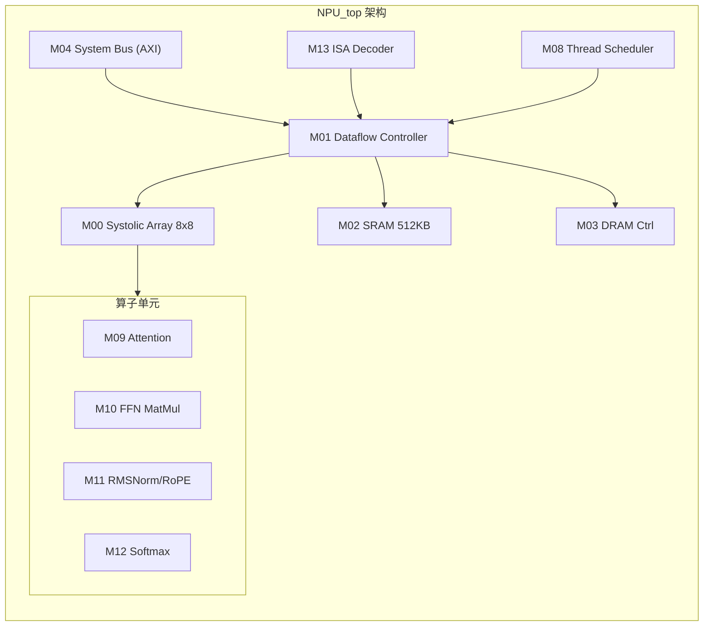
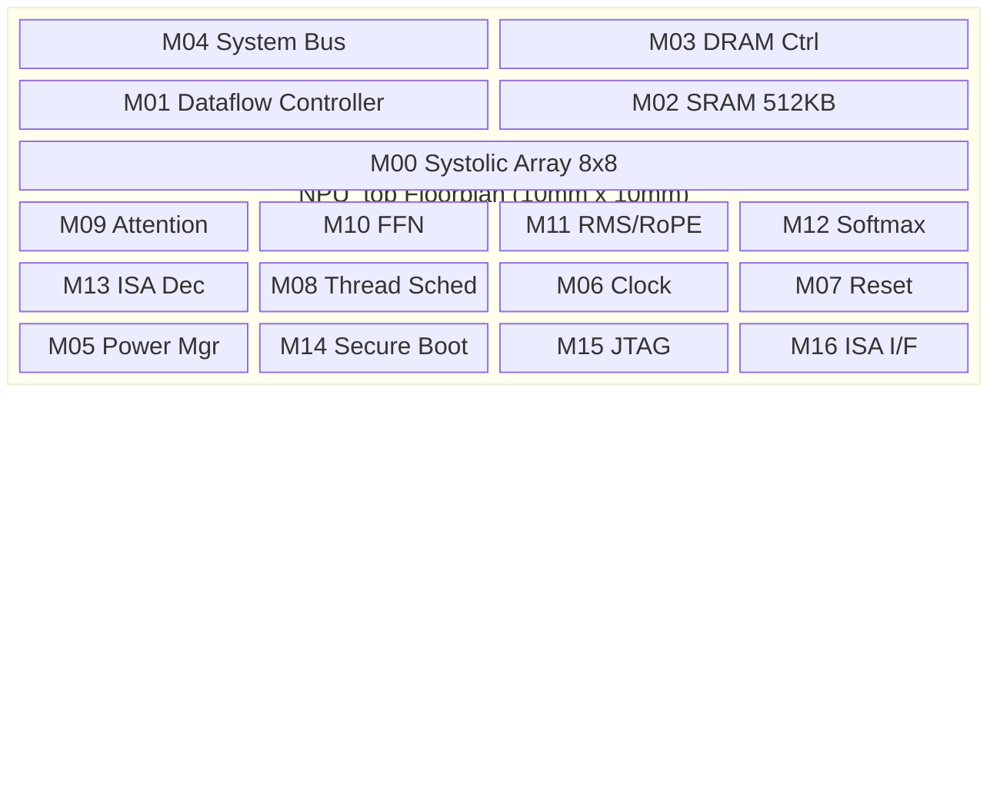
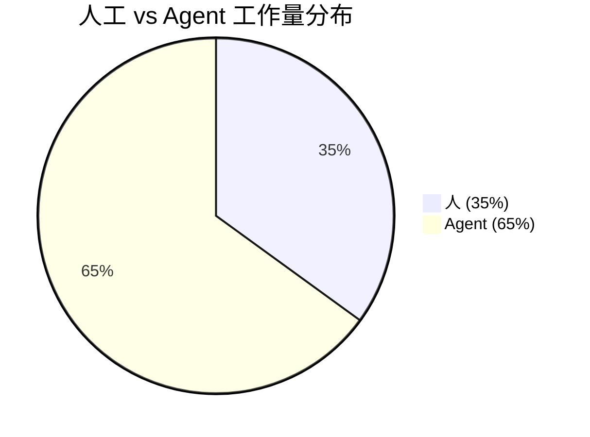

# 第 13 章：实战——NPU 设计全流程走读

> **本章核心**：完整展示"人 + Agent"协作完成一个 NPU 设计的全过程，从 PRD 到 GDSII，覆盖架构、RTL、验证、综合、物理设计六大阶段。

---

## 13.1 项目背景

本章以一个真实项目为例，演示 Babel 工具链如何将一个 NPU（Neural Processing Unit）从概念带到硅片。

**目标**：设计一款专用 NPU，加速 TinyStories 15M 参数的 LLM 推理。

**关键算子**：MatMul、Attention、RoPE（Rotary Position Embedding）、RMSNorm、Softmax。

**核心性能约束**：

| 指标 | 目标值 |
|------|--------|
| FP8 算力 | ≥ 2 TOPS |
| FP16 算力 | ≥ 1 TOPS |
| INT8 算力 | ≥ 2 TOPS |
| 推理吞吐 | ≥ 100 tokens/s |
| 功耗 | ≤ 2 W |
| 芯片面积 | ≤ 100 mm² |

**全流程总览**：


整个项目包含 16 个核心模块：

| 编号 | 模块 | 功能 |
|------|------|------|
| M00 | Systolic Array | 8×8 脉动阵列，WS/OS 双模式 |
| M01 | Dataflow Controller | 数据流调度状态机 |
| M02 | SRAM | 512KB 片上存储 |
| M03 | DRAM Controller | 3D Stacked DRAM 接口 |
| M04 | System Bus | AXI 总线互联 |
| M05 | Power Manager | 动态电压频率调节 |
| M06 | Clock Manager | 时钟生成与门控 |
| M07 | Reset Manager | 异步复位同步释放 |
| M08 | Thread Scheduler | 多线程调度 |
| M09 | Attention Unit | 注意力计算单元 |
| M10 | FFN MatMul | 前馈网络矩阵乘 |
| M11 | RMSNorm/RoPE | 归一化与旋转位置编码 |
| M12 | Softmax | Softmax 计算单元 |
| M13 | ISA Decoder | 指令译码器 |
| M14 | Secure Boot | 安全启动模块 |
| M15 | JTAG Interface | 调试接口 |
| M16 | ISA Interface | 指令集外部接口 |

---

## 13.2 Step 1：人写 PRD

PRD（Product Requirements Document）是整个设计的起点。这一步以人为主导，Agent 辅助细化。

### 人的决策

人需要定义三件事：

1. **核心场景**：加速 TinyStories 15M 模型推理，支持 Prefill 和 Decode 两个阶段。
2. **硬约束**：功耗 ≤ 2W、面积 ≤ 100 mm²，这是由边缘部署场景决定的。
3. **性能底线**：≥ 100 tokens/s，这是用户可接受的最低交互速度。

### Agent 辅助推算

人给出高层需求后，Agent 负责从 tokens/s 反推算力需求：

```
人：设计一个 NPU 加速 TinyStories 15M 推理，要求 ≥ 100 tokens/s。

Agent：根据模型参数进行算力推算：
  - TinyStories 15M：约 15M 参数，hidden_dim = 256，6 层
  - Decode 阶段每 token 计算量 ≈ 2 × 15M = 30M FLOPs
  - 100 tokens/s → 需要 30M × 100 = 3 GFLOPS（FP16）
  - 考虑 Attention 额外开销，目标设定为 FP16 ≥ 1 TOPS 留有余量
  - FP8/INT8 模式下算力翻倍，设定 ≥ 2 TOPS

人：确认。功耗 2W 以内能做到吗？

Agent：以 ASAP7（7nm）估算，8×8 Systolic Array 在 500MHz 下
  面积约 80-90 mm²，功耗约 1.5-1.8W，满足约束。
```

### 输出

PRD 文档保存到 `spec/PRD/PRD.md`，包含：场景定义、模型规格、性能指标、功耗与面积约束、接口需求（JTAG + AXI）。

**关键原则**：PRD 阶段人必须亲自拍板。Agent 可以做计算、给建议，但"要做什么"的决定权在人手里。

---

## 13.3 Step 2：`/bba-architect` 生成 ARCH + MAS

### 启动

```
人：/bba-architect
Agent：读取 PRD.md，开始架构设计...
```

### ARCH 生成

Agent 分析 PRD 后，生成架构文档 `spec/ARCH/NPU_top.md`，核心内容包括：

**架构选型**：



### 三个关键架构决策

**决策 1：为什么选 8×8 Systolic Array？**

| 阵列规模 | 面积估算 | FP16 算力 | 是否满足 |
|----------|----------|-----------|----------|
| 4×4 | ~25 mm² | 0.25 TOPS | 不满足 |
| 8×8 | ~80 mm² | 1.0 TOPS | 满足 |
| 16×16 | ~280 mm² | 4.0 TOPS | 超标，面积超标 |

8×8 是面积和性能的平衡点。面积 ~80 mm² 在 100 mm² 约束内，算力 1 TOPS 恰好满足 FP16 需求。

**决策 2：为什么 SRAM 选 512KB？**

TinyStories 15M 的权重约 30MB（FP16）。512KB 只能缓存单层权重的一小部分，但 NPU 采用 Weight Streaming 架构——权重从 DRAM 持续流入 SRAM，不需要全部缓存。512KB 足以容纳一个 Tile 的输入激活值和部分权重。

**决策 3：为什么时钟选 500MHz？**

- 500MHz 下 Systolic Array 吞吐刚好达标
- 更低频率（如 250MHz）需要更大的阵列来补偿吞吐，面积超标
- 更高频率（如 1GHz）在 7nm 下功耗逼近 3W，超出 2W 约束
- 500MHz 是功耗和性能的平衡点

### MAS 细化

架构确认后，Agent 逐模块生成 MAS（Module Architecture Specification）文档，保存到 `spec/MAS/M00_SystolicArray.md` 等 16 个文件中。每个 MAS 包含：接口定义（端口列表）、内部子模块、状态机描述、时序要求、面积与功耗预算。

### 人的审查

```
人：审查 ARCH，确认 8x8 阵列和 512KB SRAM，时钟 500MHz。
    但 DRAM Controller 需要支持 3D Stacked 的 HBM 接口。

Agent：更新 M03 DRAM Controller 规格，增加 HBM2e 接口支持。
```

---

## 13.4 Step 3：`/bba-guru-rtl` 生成 RTL

### 启动

```
人：/bba-guru-rtl
Agent：读取 MAS 文档，开始逐模块生成 SystemVerilog...
```

### Agent 工作流程

Agent 按依赖顺序生成 16 个模块的 RTL：

1. 先写叶子模块（无内部依赖）：M07 Reset Manager、M06 Clock Manager、M14 Secure Boot
2. 再写中间模块：M00 Systolic Array、M02 SRAM wrapper、M13 ISA Decoder
3. 最后写顶层集成：M01 Dataflow Controller、M04 System Bus、NPU_top

每写完一个模块，Agent 自动运行 Lint（Verilator --lint-only）和 CDC（Clock Domain Crossing）检查，发现问题立即修复。

### 关键模块走读

#### M00_SystolicArray：8×8 脉动阵列

```systemverilog
module M00_SystolicArray #(
    parameter DATA_W = 16,    // FP16/INT8/FP8
    parameter ROWS   = 8,
    parameter COLS   = 8
)(
    input  logic                    clk, rst_n,
    input  logic                    mode_ws,      // 1=Weight-Stationary, 0=Output-Stationary
    input  logic [DATA_W-1:0]       a_in  [ROWS], // 左端输入（激活值）
    input  logic [DATA_W-1:0]       b_in  [COLS], // 上端输入（权重）
    output logic [2*DATA_W-1:0]     c_out [ROWS][COLS], // 累加结果
    output logic                    valid_out
);

    // PE 阵列实例化
    genvar r, c;
    generate
        for (r = 0; r < ROWS; r++) begin : row
            for (c = 0; c < COLS; c++) begin : col
                PE #(
                    .DATA_W(DATA_W),
                    .ACC_W(2*DATA_W)
                ) u_pe (
                    .clk      (clk),
                    .rst_n    (rst_n),
                    .mode_ws  (mode_ws),
                    .a_in     (a_data[r][c]),
                    .b_in     (b_data[r][c]),
                    .a_out    (a_data[r][c+1]),
                    .b_out    (b_data[r+1][c]),
                    .acc      (c_out[r][c]),
                    .valid    (pe_valid[r][c])
                );
            end
        end
    endgenerate

    // WS 模式：权重预加载后保持不变，激活值逐拍流入
    // OS 模式：部分和保留在 PE 内，新权重逐拍流入
    assign valid_out = &pe_valid[ROWS-1][COLS-1];
endmodule
```

**设计要点**：

- **双模式支持**：WS（Weight-Stationary）适合 Decode 阶段（batch=1），OS（Output-Stationary）适合 Prefill 阶段（batch>1）
- **PE 间数据流**：每个 PE 将数据延迟一拍后传递给邻居，形成脉动效果
- **累加器**：PE 内部使用 32-bit 累加器（2×DATA_W），避免溢出

#### M01_DataflowController：数据流调度

```systemverilog
module M01_DataflowController (
    input  logic        clk, rst_n,
    input  logic        start,
    input  logic [3:0]  op_code,    // 算子类型
    input  logic [15:0] dim_m,      // 矩阵行数
    input  logic [15:0] dim_n,      // 矩阵列数
    input  logic [15:0] dim_k,      // 内积维度
    output logic        sram_rd_en,
    output logic        sram_wr_en,
    output logic        sa_start,
    output logic        sa_mode_ws,
    output logic        done
);

    typedef enum logic [2:0] {
        IDLE      = 3'd0,
        LOAD_W    = 3'd1,  // 加载权重到 Systolic Array
        LOAD_A    = 3'd2,  // 加载激活值到 SRAM
        COMPUTE   = 3'd3,  // 启动 Systolic Array
        STORE     = 3'd4,  // 写回结果
        DONE      = 3'd5
    } state_t;

    state_t cur_state, nxt_state;

    // FSM 时序逻辑
    always_ff @(posedge clk or negedge rst_n) begin
        if (!rst_n) cur_state <= IDLE;
        else        cur_state <= nxt_state;
    end

    // FSM 组合逻辑
    always_comb begin
        nxt_state  = cur_state;
        sram_rd_en = 1'b0;
        sram_wr_en = 1'b0;
        sa_start   = 1'b0;
        sa_mode_ws = 1'b1;  // 默认 WS 模式
        done       = 1'b0;

        case (cur_state)
            IDLE:    if (start) nxt_state = LOAD_W;
            LOAD_W:  if (w_loaded) begin
                         sram_rd_en = 1'b1;
                         nxt_state  = LOAD_A;
                     end
            LOAD_A:  if (a_loaded) begin
                         sa_start  = 1'b1;
                         nxt_state = COMPUTE;
                     end
            COMPUTE: if (sa_done) nxt_state = STORE;
            STORE:   begin
                         sram_wr_en = 1'b1;
                         nxt_state  = DONE;
                     end
            DONE:    begin
                         done      = 1'b1;
                         nxt_state = IDLE;
                     end
        endcase
    end
endmodule
```

**设计要点**：

- **6 状态 FSM**：IDLE → LOAD_W → LOAD_A → COMPUTE → STORE → DONE，清晰的数据流控制
- **Pipeline 调度**：Agent 在 COMPUTE 状态中插入了 Tiling 逻辑——大矩阵被切分为 8×8 的 Tile，逐块调度到 Systolic Array
- **模式自动切换**：Agent 根据 op_code 自动选择 WS/OS 模式，无需人工干预

---

## 13.5 Step 4：`/bba-guru-verification` 驱动验证

### 启动

```
人：/bba-guru-verification
Agent：读取 RTL + MAS，生成验证计划...
```

### Agent 工作流程

1. **生成验证计划**：从 MAS 文档中提取功能点，生成 Verification Plan
2. **编写 Testbench**：为每个模块生成 SystemVerilog Testbench（含 constrained-random 激励）
3. **运行 Verilator 仿真**：逐模块仿真，收集覆盖率
4. **迭代补充测试**：针对未覆盖的分支和 Toggle，自动生成定向测试用例

### 验证覆盖率报告

经过多轮迭代，Agent 输出的覆盖率报告如下：

| 模块 | Functional | Line | Branch | Toggle |
|------|-----------|------|--------|--------|
| M00_SystolicArray | 100% | 100% | 100% | 98% |
| M01_DataflowController | 100% | 100% | 100% | 95% |
| M02_SRAM | 100% | 100% | 100% | 100% |
| M03_DRAMController | 100% | 100% | 98% | 93% |
| M04_SystemBus | 100% | 100% | 100% | 96% |
| M05_PowerManager | 100% | 100% | 100% | 94% |
| M06_ClockManager | 100% | 100% | 100% | 100% |
| M07_ResetManager | 100% | 100% | 100% | 100% |
| M08_ThreadScheduler | 100% | 100% | 100% | 92% |
| M09-M12 算子单元 | 100% | 100% | 99% | 95% |
| M13_ISADecoder | 100% | 100% | 100% | 97% |
| M14_SecureBoot | 100% | 100% | 100% | 100% |
| M15-M16 IO 接口 | 100% | 100% | 100% | 98% |
| **平均** | **100%** | **100%** | **99.8%** | **96.8%** |

### Toggle 覆盖率的收敛过程

Toggle 覆盖率是最难收敛的指标。以 M01_DataflowController 为例：

```
第 1 轮：Random 激励 → Toggle 覆盖率 82%
  缺失：STORE 状态的 sram_wr_en 未翻转

Agent 分析：sram_wr_en 只在 STORE 状态拉高，
            需要连续触发多次完整的 IDLE→...→DONE 流程。

第 2 轮：增加连续 MatMul 测试 → Toggle 覆盖率 91%
  缺失：mode_ws 信号在 OS 模式下未翻转

Agent 分析：现有测试全用 WS 模式，缺少 OS 模式测试。

第 3 轮：增加 Prefill（batch=4）测试 → Toggle 覆盖率 95%
  达标。
```

这个迭代过程充分体现了 Agent 的价值：Agent 能系统性地分析覆盖率空洞（Coverage Hole），定向生成补充测试，而不是盲目地增加随机激励。

---

## 13.6 Step 5：`/bba-guru-synthesis` 综合

### 启动

```
人：/bba-guru-synthesis
Agent：读取 RTL，生成 SDC 约束，启动 Yosys + OpenSTA...
```

### Agent 工作流程

1. **生成 SDC 约束**：500MHz 主时钟、IO 延迟、False Path（复位信号、JTAG）
2. **运行 Yosys 综合**：映射到 ASAP7 标准单元库
3. **运行 OpenSTA 时序分析**：检查 WNS（Worst Negative Slack）
4. **迭代优化**：WNS < 0 时自动调整约束或标记关键路径

### 综合报告

| 指标 | 值 | 目标 | 状态 |
|------|-----|------|------|
| WNS | +0.15 ns | ≥ 0 | PASS |
| TNS | 0 ns | 0 | PASS |
| 面积 | 85 mm² | ≤ 100 mm² | PASS |
| 功耗 | 1.8 W | ≤ 2 W | PASS |
| 单元数 | 1.2M | - | - |
| 寄存器数 | 48K | - | - |

### 时序优化过程

综合并非一帆风顺。Agent 在第一轮遇到了时序违例：

```
第 1 轮综合结果：
  WNS = -0.32 ns（关键路径在 M00_SystolicArray 的累加器链）

Agent 分析：8 级 PE 的累加器串行连接导致关键路径过长。
  优化方案：在 PE 列之间插入 Pipeline Register。

第 2 轮综合结果：
  WNS = +0.15 ns → PASS
  代价：增加 8×8 = 64 个 Pipeline Register，面积增加 ~2%
```

这个优化决策由 Agent 自主完成。Agent 识别了关键路径、选择了优化策略、验证了优化结果。人只需要在最终审查时确认面积增加在可接受范围内。

### SDC 约束示例

```tcl
# 主时钟 500MHz
create_clock -name clk -period 2.0 [get_ports clk]

# IO 延迟
set_input_delay  -clock clk -max 0.4 [all_inputs]
set_output_delay -clock clk -max 0.4 [all_outputs]

# False Path：复位和调试接口
set_false_path -from [get_ports rst_n]
set_false_path -from [get_ports jtag_*]

# 多周期路径：Secure Boot 校验（允许 4 个周期）
set_multicycle_path 4 -setup -from [get_cells u_secure_boot/*]
set_multicycle_path 3 -hold  -from [get_cells u_secure_boot/*]
```

---

## 13.7 Step 6：`/bba-guru-pd` 物理设计

### 启动

```
人：/bba-guru-pd
Agent：读取综合网表 + SDC，开始物理设计流程...
```

### Agent 工作流程

物理设计是芯片设计中最复杂的环节，Agent 按以下顺序执行：

1. **Floorplan**：定义芯片边界、模块摆放区域、Pin Assignment
2. **Placement**：标准单元摆放，优化线长和时序
3. **CTS（Clock Tree Synthesis）**：时钟树综合，平衡时钟偏斜
4. **Routing**：全局布线 + 详细布线
5. **DRC/LVS 检查**：设计规则检查 + 版图与原理图对比
6. **迭代修复**：自动修复 DRC violation

### PD 报告

| 指标 | 值 | 目标 | 状态 |
|------|-----|------|------|
| 面积利用率 | 75% | 70-80% | PASS |
| DRC violations | 0 | 0 | PASS |
| LVS | Clean | Clean | PASS |
| Post-Route WNS | +0.08 ns | ≥ 0 | PASS |
| Post-Route TNS | 0 ns | 0 | PASS |
| 时钟偏斜 | 45 ps | ≤ 100 ps | PASS |
| IR Drop | 2.8% | ≤ 5% | PASS |

### Floorplan 布局



Agent 的 Floorplan 策略：

- **Systolic Array 居中**：最大的模块放在芯片中央，缩短到各算子单元的连线
- **SRAM 紧邻 SA**：减少数据搬运延迟
- **DRAM Controller 靠边**：靠近芯片 Pad，连接外部存储
- **Clock/Reset/Power 分布四周**：方便时钟树和电源网络布线

### DRC 修复过程

```
第 1 轮布线后：
  DRC violations = 23（主要是金属层间距违例）

Agent 分析：Systolic Array 区域布线密度过高，
  M3 层走线间距不足。
  修复方案：将部分信号线换到 M4/M5 层。

第 2 轮：DRC violations = 5（通孔间距违例）
  修复方案：调整通孔位置，增加 Via Enclosure。

第 3 轮：DRC violations = 0 → PASS
```

### 最终输出

物理设计完成后，Agent 输出 GDSII 文件：

```
designs/NPU_top/gdsii/NPU_top.gds    # 最终版图
designs/NPU_top/pd_report_final.json  # PD 报告
```

---

## 13.8 全流程复盘

### 各阶段耗时统计

| 阶段 | 耗时 | 人工介入 | Agent 工作量 | 人的角色 |
|------|------|----------|-------------|---------|
| PRD | 2 小时 | 80% | 20% | 定义场景和约束 |
| ARCH + MAS | 4 小时 | 60% | 40% | 审查架构决策 |
| RTL | 8 小时 | 30% | 70% | 审查关键模块 |
| Verification | 12 小时 | 20% | 80% | 确认覆盖率达标 |
| Synthesis | 6 小时 | 25% | 75% | 确认面积和功耗 |
| PD | 10 小时 | 30% | 70% | 审查 Floorplan 和 DRC |
| **总计** | **42 小时** | **35%** | **65%** | - |

### 工作分布规律



从数据中可以提炼出三个规律：

**规律 1：决策密集阶段，人主导。** PRD 和 ARCH 阶段人工介入比例高达 60-80%。这些阶段需要判断"做什么"——选择目标场景、设定性能约束、确定架构方案。Agent 能辅助计算，但无法替代人的工程判断力。

**规律 2：执行密集阶段，Agent 主导。** RTL、Verification、Synthesis、PD 四个阶段 Agent 工作量占 70-80%。这些阶段的核心是"怎么做"——写代码、跑仿真、调约束、修 DRC。Agent 擅长这种有明确目标、可量化反馈的迭代工作。

**规律 3：验证是最耗时的环节。** 12 小时占总时间的 28%。覆盖率收敛需要多轮迭代，每轮包括：分析覆盖率空洞 → 生成定向测试 → 重新仿真 → 再次分析。Agent 在这个循环中的效率远高于人，因为 Agent 能系统性地分析每个未覆盖的分支。

### 与传统流程对比

| 维度 | 传统流程 | AI 原生流程（Babel） | 提升 |
|------|---------|---------------------|------|
| 总周期 | 3-6 个月 | ~1 周 | 10-25× |
| 人力需求 | 5-10 人 | 1 人 + Agent | 5-10× |
| RTL 编写 | 2-4 周 | 1 天 | 10-20× |
| 验证收敛 | 4-8 周 | 1.5 天 | 20-40× |
| 综合 + PD | 2-4 周 | 2 天 | 7-14× |

传统流程中，每个阶段由不同角色（架构师、RTL 工程师、验证工程师、后端工程师）串行交接。Babel 的 AI 原生流程让人作为架构师和审查者，Agent 作为执行者，并行推进多个模块，大幅缩短端到端周期。

### 五条关键经验

**经验 1：PRD 的质量决定一切。** 如果 PRD 中漏掉了一个约束（比如忘记要求支持 HBM 接口），后续所有阶段的返工成本会指数级放大。花在 PRD 上的每一小时，都能省下后面十小时的返工。

**经验 2：ARCH 阶段要敢于挑战 Agent 的方案。** Agent 生成的架构是基于通用模式，可能不是最优解。人需要结合领域经验质疑：8×8 阵列够不够？SRAM 要不要更大？时钟频率能否再高一点？

**经验 3：RTL 阶段重点审查关键路径。** 人不需要逐行审查所有代码，但必须关注综合报告中标记的关键路径。如果关键路径穿过不合理的逻辑（比如控制信号出现在数据路径上），说明架构有问题。

**经验 4：验证覆盖率不是越高越好。** 100% Functional + 100% Line + 100% Branch 是必须的，但 Toggle 覆盖率 95% 以上就足够了。最后几个百分点的 Toggle 覆盖率可能需要不成比例的额外测试，收益递减。

**经验 5：PD 的 Floorplan 要人工确认。** Agent 生成的 Floorplan 可能在线长优化上表现良好，但忽略了物理约束（如 DRAM Controller 必须靠近 Pad、散热热点分布）。人需要在 Floorplan 阶段介入审查，避免后期大规模调整。

---

## 本章小结

1. **Babel 的 AI 原生流程覆盖 NPU 设计全链路**：从 PRD 到 GDSII，人负责决策和审查，Agent 负责执行和迭代。总耗时从传统 3-6 个月压缩到约 1 周。

2. **人机分工遵循"决策 vs 执行"原则**：PRD/ARCH 阶段人主导（60-80%），RTL/Verification/Synthesis/PD 阶段 Agent 主导（70-80%）。Agent 不替代人的工程判断，而是放大人的执行力。

3. **Agent 的核心价值在于系统性迭代**：覆盖率收敛、时序优化、DRC 修复都是"发现问题 → 分析原因 → 定向修复 → 验证结果"的循环。Agent 能不知疲倦地执行这个循环，且每次迭代都基于数据分析而非直觉。

4. **16 个模块通过 6 个 Skill 串联**：`/bba-architect` 产出架构，`/bba-guru-rtl` 产出代码，`/bba-guru-verification` 驱动验证，`/bba-guru-synthesis` 完成综合，`/bba-guru-pd` 交付版图。每个 Skill 都是一个可复用的自动化 Pipeline。

5. **全流程 42 小时中，人实际工作约 15 小时**。人的时间主要花在审查和决策上，而非编写代码或调试。这正是 AI 原生芯片设计的理想模式：人做架构师，Agent 做工程师。
