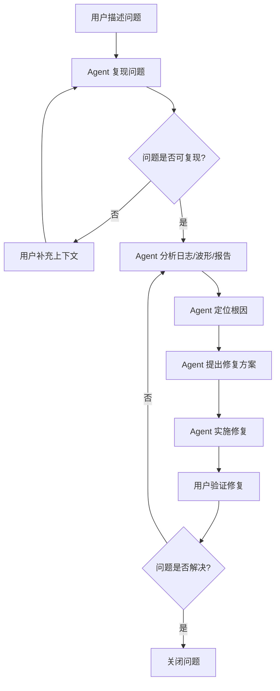

# 第 14 章：与 AI 协同调试

> **本章核心**：调试由 Agent 主导分析，人的角色是描述问题和验证解决方案

## 14.1 调试方法论

### 三步法

与 AI 协同调试的核心方法论是三步循环：**复现 → 定位 → 修复**。人在每一步中负责提供上下文和验证结果，Agent 负责分析和建议。

1. **复现**：让 Agent 复现问题（提供最小可复现案例）
2. **定位**：让 Agent 分析日志、波形、报告，定位根因
3. **修复**：让 Agent 提出解决方案并实施



### 关键原则

**描述问题而非猜测原因**。用户只需提供准确的现象描述，而不是先入为主地给出假设。错误的假设会误导 Agent 的分析方向，浪费调试时间。

**提供最小可复现案例**。问题复现的最小上下文越精确，Agent 定位根因的速度越快。比如不要说"仿真不通过"，而要说"运行 `make sim TEST=test_matmul` 时，在 cycle 5320 断言失败，期望值 0x4A，实际值 0x00"。

**一次只修一个问题**。多个问题交织在一起时，调试复杂度呈指数增长。先用 Issue 系统（14.7 节）记录所有问题，然后逐个击破。

## 14.2 环境配置问题

环境问题是芯片开发流程中最常见、也最容易被忽视的一类故障。它们通常在流程启动时就暴露出来，表现为"工具找不到"或"库文件缺失"。

### 问题 1：工具找不到

```
用户：运行 yosys 报错 "command not found"

Agent 分析：
  → 检查 PATH：yosys 不在 PATH 中
  → 检查安装目录：~/wrk/eda_opensources/yosys/bin/yosys 存在
  → 发现 eda_env.sh 未被 source
  → 执行 source ~/wrk/eda_opensources/eda_env.sh
  → 验证：which yosys → 输出路径正确
  → 问题解决
```

**给用户的建议**：在终端启动后第一次使用 EDA 工具前，始终先执行 `source ~/wrk/eda_opensources/eda_env.sh`。可以将这行命令加入 `~/.bashrc` 以避免每次手动执行。

### 问题 2：库文件缺失

```
用户：Magic 启动报错 "libtcl.so: cannot open shared object file"

Agent 分析：
  → 检查 LD_LIBRARY_PATH：未包含 tcl 库路径
  → 搜索系统中 libtcl.so 的位置：find /usr -name "libtcl*"
  → 发现 /usr/lib/x86_64-linux-gnu/libtcl8.6.so
  → 添加 export LD_LIBRARY_PATH=/usr/lib/x86_64-linux-gnu:$LD_LIBRARY_PATH
  → 创建符号链接 libtcl.so -> libtcl8.6.so
  → 重新启动 Magic → 正常
  → 问题解决
```

**给用户的建议**：库文件问题通常与操作系统版本相关。如果升级了系统，建议重新运行 EDA 环境安装脚本。

## 14.3 RTL 设计问题

### 问题 1：Lint 错误

```
用户：Lint 报告有 15 个 warning，请帮我修复

Agent 分析：
  → 读取 lint_report.log
  → 分类统计违规类型：
    - 10 个 "incomplete case"（case 语句缺少 default 分支）
    - 5 个 "latch inferred"（组合逻辑推断出锁存器）
  → 修复 incomplete case：在每个 case 语句中添加 default 分支
  → 修复 latch inferred：将 always @(*) 改为 always_comb（SystemVerilog），
    确保所有信号在每条路径上都有赋值
  → 重新运行 Lint → 0 warning
  → 问题解决
```

**关键技巧**：让 Agent 先看完整的 lint 报告再动手修改，而不是一条条处理。整体视角能避免修一条引入另一条的情况。

### 问题 2：CDC 违规

CDC（Clock Domain Crossing）是 SoC 设计中极易出错的问题，也是 Agent 分析能力最能体现价值的场景。

```
用户：CDC 报告显示 3 条跨时钟域路径违规

Agent 分析：
  → 读取 cdc_report.txt
  → 分析 3 条违规路径：
    路径 1: clk_sys → clk_aon，信号 pwr_req，缺少同步器
    路径 2: clk_sys → clk_aon，信号 pwr_ack，缺少同步器
    路径 3: clk_fast → clk_slow，信号 data_valid，缺少同步器
  → 修复方案：
    路径 1-2：添加两级 FF 同步器（2-FF synchronizer）
    路径 3：添加 DMUX 同步器（data + valid 分离同步）
  → 生成同步器 RTL 代码
  → 重新运行 CDC 检查 → 0 违规
  → 问题解决
```

**给用户的建议**：CDC 问题的修复方案取决于信号类型。单 bit 控制信号用 2-FF 同步器，多 bit 数据用 DMUX 或异步 FIFO。让 Agent 根据信号特征自动选择最合适的方案。

### 问题 3：功能错误

功能错误往往最耗时，因为现象和根因之间可能隔着很长的因果链。

```
用户：仿真波形显示 FSM 卡在 IDLE 状态，永远不会转移到 RUN

Agent 分析：
  → 读取波形文件（VCD/FST）
  → 对照 MAS 文档检查 FSM 状态转移条件
  → MAS 规定：IDLE → RUN 的条件是 start == 1 && config_done == 1
  → 检查波形：start 信号在整个仿真过程中保持 0
  → 追溯 start 信号来源：由 testbench 的激励生成模块驱动
  → 检查 testbench：发现初始化序列中遗漏了 start 信号的拉高操作
  → 修复 testbench 激励生成逻辑
  → 重新仿真 → FSM 正常转移
  → 问题解决
```

**关键技巧**：功能调试时，让 Agent 同时查看 MAS 规范文档和实际波形，对照分析比盲猜高效得多。

## 14.4 验证问题

### 问题 1：仿真挂起

```
用户：Verilator 仿真运行 10 分钟后无响应，没有产生任何输出

Agent 分析：
  → 检查仿真进程状态：CPU 占用 100%，未 crash
  → 导出当前时刻的波形快照
  → 分析信号活动：
    - master_valid = 1（master 在请求）
    - slave_ready = 0（slave 未响应）
    - slave_valid = 1（slave 也在请求）
    - master_ready = 0（master 也未响应）
  → 诊断：典型的握手协议死锁（valid-ready 互等）
  → 追溯根因：FSM 的 RECV 状态等待 slave_valid，但 slave 也在等待 master_ready
  → 修复：在 FSM 中添加超时机制，超过 N 个 cycle 未收到响应则返回 IDLE
  → 重新仿真 → 正常完成
  → 问题解决
```

### 问题 2：覆盖率不达标

```
用户：Functional coverage 只有 85%，目标是 95%

Agent 分析：
  → 读取覆盖率报告（coverage.dat）
  → 分析未覆盖的 coverpoint：
    - FSM_ERROR_STATE：ERROR 状态从未被进入（0 hits）
    - FIFO_OVERFLOW：FIFO 满时继续写入的场景未覆盖（0 hits）
    - ARB_PRIORITY_3：优先级 3 的仲裁从未发生（0 hits）
  → 根因：随机测试的约束条件未覆盖这些 corner case
  → 修复：生成 3 个定向测试用例
    - test_error_inject：注入总线错误触发 ERROR 状态
    - test_fifo_overflow：快速写满 FIFO 后继续写入
    - test_arb_priority3：只激活优先级 3 的请求源
  → 合并运行随机测试 + 定向测试
  → 覆盖率提升到 97%
  → 问题解决
```

**给用户的建议**：覆盖率差距通常集中在少数几个 coverpoint 上。让 Agent 先分析"哪些没覆盖"，再生成针对性测试，比盲目增加随机测试数量高效得多。

## 14.5 综合问题

### 问题 1：时序违例

时序收敛是综合阶段最核心的挑战。

```
用户：WNS = -0.3 ns（setup violation），目标 WNS >= 0

Agent 分析：
  → 读取 timing report（sta_report.rpt）
  → 定位关键路径：
    起点：SystolicArray/PE[3][3]/acc_reg
    终点：SystolicArray/PE[3][3]/out_reg
    路径延迟：2.3 ns（约束 2.0 ns）
    违例量：-0.3 ns
  → 分析路径组成：
    4 级加法器级联 + 1 个 MUX = 总延迟 2.3 ns
  → 修复方案：在累加器中间插入 1 级流水线寄存器
    将 4 级加法器拆成 2+2，中间加 pipeline register
  → 修改 RTL，重新综合
  → WNS = +0.15 ns → 时序收敛
  → 问题解决
```

**注意事项**：插入流水线寄存器会增加 latency，需要确认上层设计能承受额外的延迟周期。让 Agent 同时检查流水线对功能正确性的影响。

### 问题 2：面积过大

```
用户：面积 120 mm²，超出 100 mm² 预算

Agent 分析：
  → 读取面积报告（area_report.rpt）
  → 分析单元面积分布：
    - SRAM：72 mm²（60%）
    - 逻辑单元：30 mm²（25%）
    - 其他：18 mm²（15%）
  → SRAM 是面积瓶颈
  → 深入分析 SRAM 配置：
    当前：4 个 bank，每个 256 KB，总计 1 MB
    需求分析：实际工作集只需要 512 KB
  → 修复方案：
    - 减少 bank 数量：4 → 2
    - 缩小 bank 容量：256 KB → 256 KB（保持不变）
    - 总面积：2 × 256 KB = 512 KB，SRAM 面积降至约 36 mm²
  → 修改配置参数，重新综合
  → 总面积：84 mm² → 满足预算
  → 问题解决
```

## 14.6 物理设计问题

### 问题 1：DRC 违规

```
用户：DRC 报告显示 50 个 metal spacing violation

Agent 分析：
  → 读取 DRC 报告（drc_report.txt）
  → 分析违规位置分布：
    - 45 个违规集中在 M3 层
    - 集中在 SystolicArray 模块的东侧出口
  → 诊断：该区域 routing 拥塞，通道利用率 > 95%
  → 修复方案：
    1. 在 Floorplan 阶段添加 partial blockage，禁止 M3 在该区域布线
    2. 将部分 M3 走线提升到 M4/M5 高层金属
    3. 调整 pin assignment，分散出口
  → 修改 floorplan 约束，重新布线
  → DRC 违规降至 3 个（可手动修复）
  → 问题解决
```

### 问题 2：LVS 不匹配

```
用户：LVS 报告 "net mismatch"，layout 和 schematic 不一致

Agent 分析：
  → 读取 LVS 报告（lvs_report.txt）
  → 分析不匹配的具体网络：
    - layout 中有 net VDD_IO，schematic 中没有
    - schematic 中有 net VDD_CORE，layout 中连到了 VDD_IO
  → 诊断：Power Domain 的 level shifter 未正确实例化
    VDD_CORE 和 VDD_IO 之间需要 level shifter 进行电压转换
  → 检查网表：level shifter 实例确实缺失
  → 修复：在 Power Domain 边界添加 level shifter 实例
  → 重新运行 LVS → Clean
  → 问题解决
```

## 14.7 使用 Issue 系统管理 Bug

调试过程中发现的问题如果只记录在对话历史中，随着对话刷新很容易被遗忘。Babel 项目提供了 Issue 系统来持久化管理 Bug。

### 三个 Skill 命令

| 命令 | 功能 |
|------|------|
| `/bb-create-issue` | 创建问题记录 |
| `/bb-list-issues` | 查看所有问题 |
| `/bb-close-issue` | 关闭已解决的问题 |

### 使用示例

```bash
# 创建一个新问题
/bb-create-issue "M00_SystolicArray setup violation on critical path"

# 查看当前所有问题
/bb-list-issues
# 输出：
# #1 [OPEN] M00_SystolicArray setup violation on critical path (2026-05-30)
# #2 [CLOSED] M02_SRAM CDC missing synchronizer (2026-05-29)
# #3 [OPEN] M05_PowerManager LVS net mismatch (2026-05-30)

# 问题解决后关闭
/bb-close-issue 1
```

### Issue 系统的好处

**问题可追溯**。每个问题有独立编号和状态，不会因为对话窗口关闭而丢失。跨 session 工作时，一条 `/bb-list-issues` 就能快速恢复上下文。

**问题可分类**。通过标签系统对问题进行分类：

| 标签 | 含义 |
|------|------|
| `rtl-needs-fix` | RTL 设计需要修改 |
| `verif-needs-fix` | 验证环境或测试用例需要修改 |
| `synth-needs-fix` | 综合约束或策略需要调整 |
| `pd-needs-fix` | 物理设计需要修改 |

**问题可统计**。通过分析 Issue 的分类分布，可以发现流程中的薄弱环节。例如，如果 `rtl-needs-fix` 类问题占比过高，说明 RTL 编码规范需要加强；如果 `synth-needs-fix` 过多，可能意味着综合约束设置不合理。这种数据驱动的改进比凭直觉优化更有针对性。

## 本章小结

1. **三步循环是核心**。复现 → 定位 → 修复，Agent 负责分析和执行，人负责描述问题和验证结果。

2. **描述问题比猜测原因更重要**。提供精确的现象描述（错误信息、波形特征、报告数据），让 Agent 从客观事实出发进行分析，避免被错误假设误导。

3. **不同阶段的问题有不同的调试策略**。环境配置问题靠检查环境变量，RTL 问题靠对照规范和报告，验证问题靠分析波形和覆盖率，综合问题靠分析 timing/area report，物理设计问题靠分析 DRC/LVS 报告。

4. **一次只修一个问题，用 Issue 系统管理全局**。多问题交织时先记录、再排序、逐个击破。优先级原则：环境 > 功能正确性 > 时序 > 面积 > DRC/LVS。

5. **修复后必须回归验证**。每一次修复都可能引入新问题。修改 RTL 后需要重新仿真、重新综合、重新检查时序，确保修复没有破坏其他功能。
