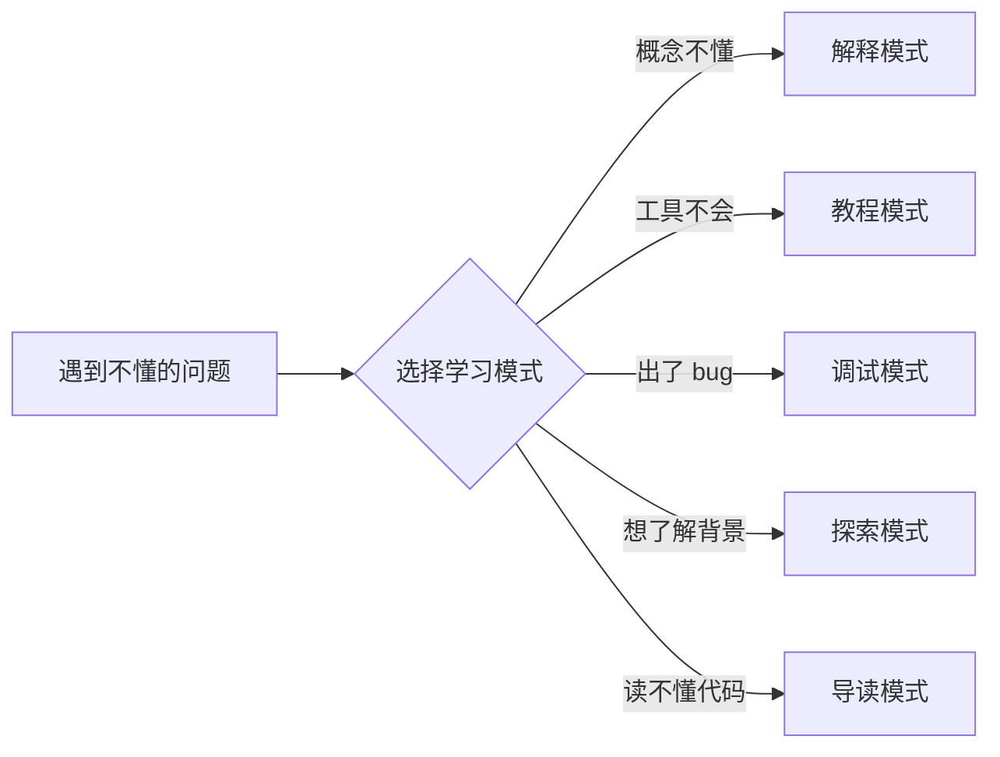
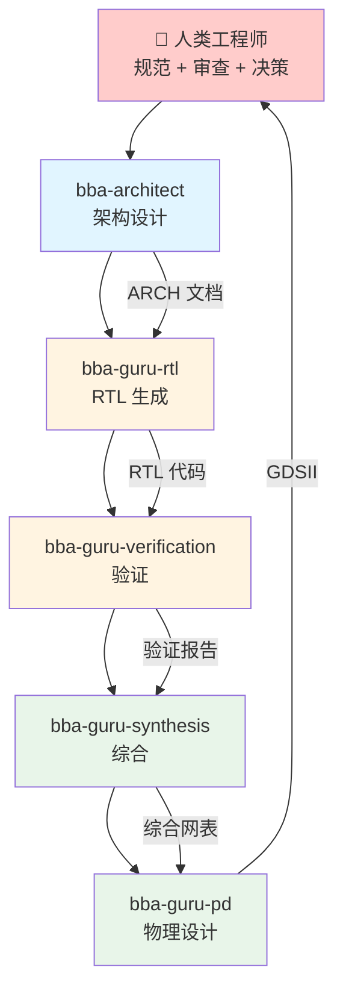
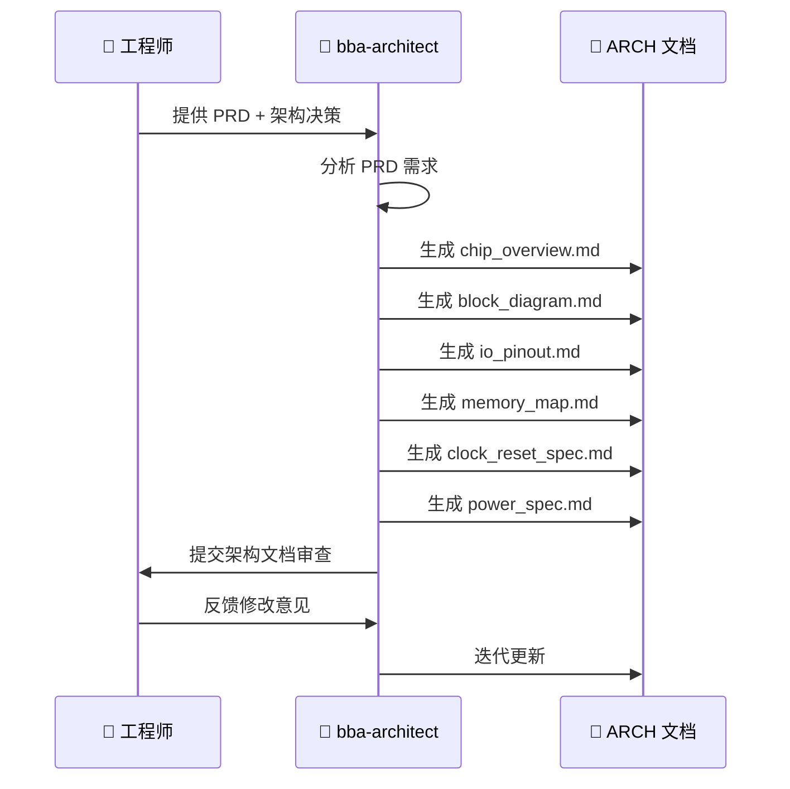
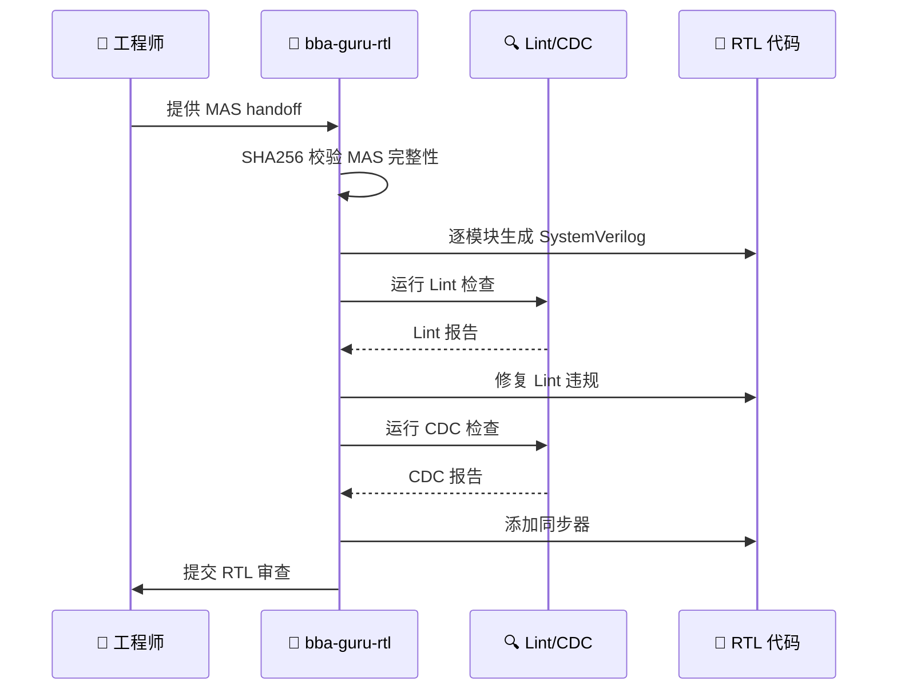
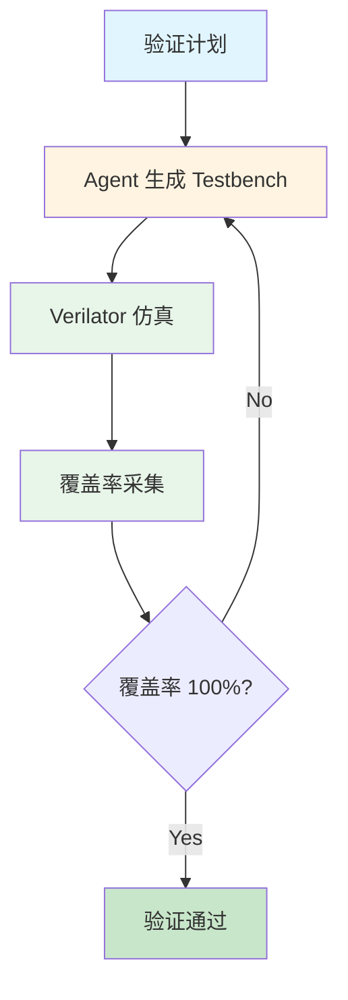
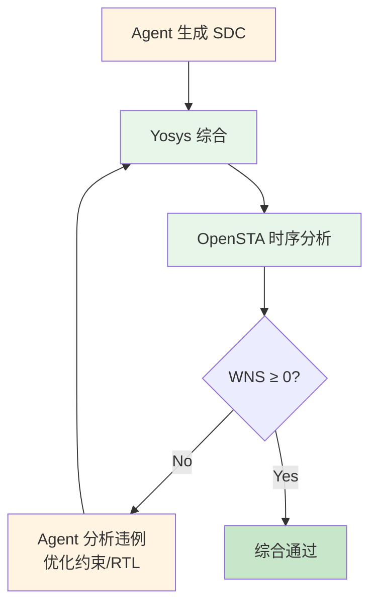
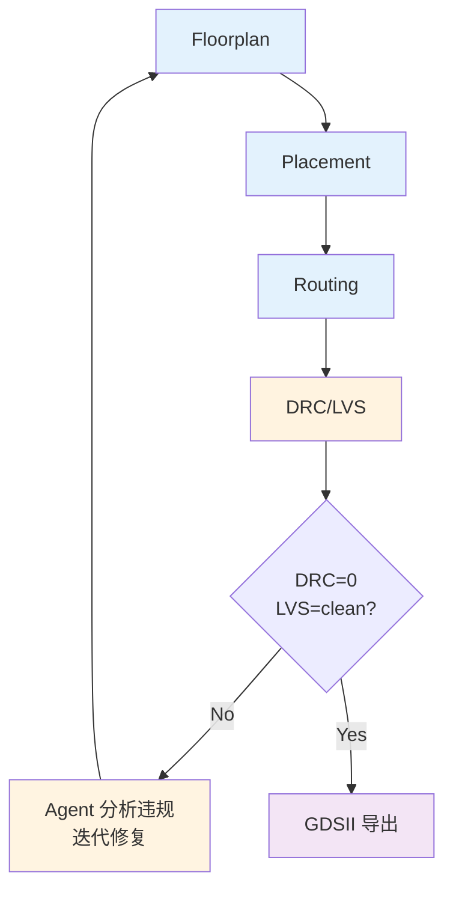

# Babel 项目学习教程（提纲）

> **目标读者**：电子工程/微电子专业本科毕业生
> **前置知识**：数字电路基础、Verilog 基础、半导体物理基础
> **核心理念**：人写规范 → Agent 生成 → 人审结果 → 迭代收敛
> **输出格式**：Markdown + Mermaid 图表
> **编号约定**：文件名 = 语义 ID（永不变），章节序号 = 显示层（可变）

---

## 教程结构总览

**编号约定**：文件名使用语义 ID（如 `ai-native-paradigm.md`），永久不变。章节标题中的"第 N 章"为显示序号，可随结构调整而变化。交叉引用一律使用语义 ID。

```
tutorial/
  outline.md                   ← 本文件（提纲与编号约定）

  Part I: 范式与准备
  ai-native-paradigm.md        ← AI 原生芯片设计范式
  prerequisites.md             ← 前置知识与环境准备
  ai-research-learn.md         ← 用 Claude Code 学习/研究/搜索任何问题
  collaboration-patterns.md    ← 人机协作模式

  Part II: 规范驱动设计（Spec-Driven）
  prd.md                       ← 用 AI 编写产品需求
  architecture.md              ← Agent 驱动的架构设计
  mas.md                       ← Agent 生成微架构规范

  Part III: AI 实现流程
  rtl-generation.md            ← Agent 生成 RTL 代码
  ai-verification.md           ← Agent 驱动的验证闭环
  ai-synthesis.md              ← Agent 驱动的逻辑综合
  ai-physical-design.md        ← Agent 驱动的物理设计

  Part IV: 工具链与实战
  eda-toolchain-setup.md       ← 用 Claude Code 搭建 EDA 工具链
  hands-on-npu.md              ← 实战：NPU 全流程走读
  ai-debugging.md              ← 与 AI 协同调试

  Part V: 参考
  glossary.md                  ← 术语表
  references.md                ← 延伸阅读与参考资料
```

---

## Part I：范式与准备

### 第 1 章：AI 原生芯片设计范式 (`ai-native-paradigm.md`)

> **本章核心**：理解"AI 原生"不是"AI 辅助"，而是"AI 主导执行、人主导决策"

- 1.1 从传统流程到 AI 原生流程
  - 传统 IC 设计：工程师亲手完成每一步
  - AI 辅助设计：工程师用 AI 做局部加速（如代码补全）
  - **AI 原生设计**：Agent 驱动全流程，人负责规范和审查

```mermaid
flowchart TB
    subgraph Traditional["传统模式：人是执行者"]
        direction LR
        T1[工程师写文档] --> T2[工程师写 RTL]
        T2 --> T3[工程师写 TB]
        T3 --> T4[工程师调综合]
        T4 --> T5[工程师做 PD]
    end

    subgraph AIAssisted["AI 辅助模式：人是执行者 + AI 帮忙"]
        direction LR
        A1[工程师写文档] --> A2[工程师写 RTL<br/>AI 补全]
        A2 --> A3[工程师写 TB<br/>AI 补全]
        A3 --> A4[工程师调综合<br/>AI 建议]
        A4 --> A5[工程师做 PD<br/>AI 建议]
    end

    subgraph AINative["AI 原生模式：AI 是执行者 + 人做决策"]
        direction LR
        N1[人写 PRD] --> N2[Agent 生成<br/>ARCH]
        N2 --> N3[Agent 生成<br/>MAS]
        N3 --> N4[Agent 生成<br/>RTL + TB]
        N4 --> N5[Agent 执行<br/>综合 + PD]
        N5 -.->|人审查| N1
    end
```



- 1.2 Babel 项目核心理念
  - Spec-Driven Development：规范文档是唯一真相源
  - Agent Pipeline：PRD → ARCH → MAS → RTL → VER → SYN → PD
  - Quality Gates：每个阶段的自动化质量检查
  - 开源 EDA 工具链：降低芯片设计的准入门槛
- 1.3 Babel 项目结构速览
  - 目录结构与文件组织
  - 关键文件说明（CLAUDE.md、spec/、rtl/、designs/）
  - Issue 追踪系统（bb-create-issue / bb-list-issues）
- 1.4 角色转变：从"工程师"到"架构师 + 审查者"
  - 你需要做什么：写清楚规范、审查 Agent 输出、做关键决策
  - Agent 做什么：生成代码、运行工具、分析结果、迭代修复
  - 人机分工矩阵

| 任务 | 传统模式 | AI 原生模式 |
|------|---------|------------|
| 需求定义 | 人 | 人（AI 辅助细化） |
| 架构设计 | 人 | 人定方向 + Agent 展开 |
| 微架构规范 | 人 | Agent 生成 + 人审查 |
| RTL 编码 | 人 | Agent 生成 + 人审查 |
| 验证 | 人写 TB + 跑仿真 | Agent 生成 TB + 驱动覆盖率收敛 |
| 综合 | 人调约束 + 分析 | Agent 迭代 + 人审查时序 |
| 物理设计 | 人做 PD | Agent 执行 + 人审查 DRC/LVS |

- 1.5 与传统 IC 设计流程的完整对比

---

### 第 2 章：前置知识与环境准备 (`prerequisites.md`)

> **本章核心**：补齐"与 AI 协作"的技能树，而不仅仅是传统 IC 知识

- 2.1 数字电路基础回顾（速查）
  - 组合逻辑与时序逻辑
  - 状态机（FSM）
  - 时钟、复位、跨时钟域
- 2.2 Verilog/SystemVerilog 基础（速查）
  - module 结构与端口声明
  - always 块与赋值语义
  - 参数化设计与 generate
- 2.3 AI/ML 硬件加速基础
  - 神经网络基本结构与算子
  - 矩阵运算与脉动阵列
  - Transformer 架构与推理瓶颈
- 2.4 与 AI Agent 协作的基本能力
  - Claude Code 安装与配置
  - 自然语言描述设计意图（Prompt Engineering for IC）
  - 如何审查 Agent 生成的 RTL / 脚本 / 报告
  - 如何给 Agent 有效的反馈（迭代收敛的关键）
- 2.5 开发环境准备
  - Linux 基础命令
  - Git 版本控制
  - 项目克隆与初始化

---

### 第 3 章：用 Claude Code 学习/研究/搜索任何问题 (`ai-research-learn.md`)

> **本章核心**：AI 原生不只是"用 AI 干活"，更是"用 AI 学习"——建立随时可调用的专家导师

- 3.1 AI 辅助学习的范式转变
  - 从"查文档 + 搜索引擎"到"对话式学习"
  - Claude Code 作为 24/7 可用的专家导师
  - 学习 ≠ 记忆，而是建立知识连接
- 3.2 五种学习模式



**模式 1：概念理解（Explain Mode）**
- 场景：遇到不懂的专业术语或概念
- Prompt 模板：
  ```
  用 3 个层次解释 [概念]：
  1. 一句话通俗解释（给外行听）
  2. 技术解释（给电子系本科生听）
  3. 深入细节（包含数学/物理原理）
  最后给一个类比帮助理解。
  ```
- 示例：
  - "解释 setup time 和 hold time"
  - "什么是亚稳态？为什么跨时钟域需要两级同步器？"
  - "脉动阵列为什么适合矩阵乘法？"

**模式 2：工具教程（Tutorial Mode）**
- 场景：学习某个 EDA 工具或技术的使用方法
- Prompt 模板：
  ```
  我要学习 [工具名] 的 [具体功能]。
  请给出：
  1. 最小可运行示例（Hello World 级别）
  2. 逐步解释每一行在做什么
  3. 常见错误和解决方法
  4. 进阶用法
  ```
- 示例：
  - "教我如何用 Yosys 综合一个 4-bit 计数器"
  - "Verilator 怎么生成 VCD 波形文件？"
  - "OpenSTA 的 SDC 约束怎么写？"

**模式 3：问题诊断（Debug Mode）**
- 场景：遇到错误、bug、不符合预期的行为
- Prompt 模板：
  ```
  我遇到了这个问题：
  [粘贴错误信息或描述现象]
  
  我的代码/环境是：
  [粘贴相关代码或环境信息]
  
  请：
  1. 分析可能的原因（列出 3-5 个最可能的）
  2. 给出验证每个假设的方法
  3. 给出最可能的解决方案
  ```
- 示例：
  - "综合报告里 setup time violation，怎么定位关键路径？"
  - "Verilator 仿真结果和预期不符，波形显示信号 X，为什么？"

**模式 4：知识探索（Explore Mode）**
- 场景：想了解某个领域的背景、现状、发展趋势
- Prompt 模板：
  ```
  我想深入了解 [主题]。请给出：
  1. 历史背景（这个技术为什么出现？）
  2. 核心原理（它是怎么工作的？）
  3. 当前应用（谁在用？用在哪？）
  4. 发展趋势（未来方向是什么？）
  5. 推荐资源（论文/书籍/课程）
  ```
- 示例：
  - "Chiplet 技术的前世今生"
  - "开源 EDA 工具的发展现状"
  - "RISC-V 为什么火？和 ARM 的竞争格局"

**模式 5：代码导读（Code Reading Mode）**
- 场景：阅读开源代码或项目中的复杂模块
- Prompt 模板：
  ```
  我要读懂 [文件/模块名] 的代码。
  请：
  1. 先给出整体架构（这个模块做什么？输入输出是什么？）
  2. 逐段解释关键代码（标注行号）
  3. 画出数据流图或状态转移图
  4. 指出设计亮点和潜在问题
  ```
- 示例：
  - "导读 NPU_top 的 dataflow_controller.v"
  - "这个 AXI4-Lite slave 模块是怎么处理握手的？"

- 3.3 高效提问的技巧
  - **提供上下文**：不要问孤立的问题，给出背景信息
  - **明确目标**：告诉 AI 你想达到什么目的
  - **分步提问**：复杂问题拆成多个小问题
  - **追问细节**：不满足于一知半解，继续深挖
  - **要求验证**：让 AI 给出验证方法，而不仅仅是答案
- 3.4 验证 AI 回答的可靠性
  - 交叉验证：用官方文档或教科书确认关键信息
  - 实验验证：让 AI 给出可运行的示例，亲自测试
  - 逻辑验证：检查推理过程是否合理
  - 边界验证：问 AI "什么情况下这个答案会失效？"
- 3.5 构建个人知识库
  - 让 Claude Code 帮你整理学习笔记
  - 建立术语表（中英对照 + 解释）
  - 收集常用 Prompt 模板
  - 记录踩坑经验（让 AI 帮你分析根因）
- 3.6 实战案例：从零学习一个陌生协议
  - 场景：项目需要用到 AXI-Stream 协议，但你从未接触过
  - Step 1：让 AI 解释 AXI-Stream 是什么、用在哪
  - Step 2：让 AI 给出最简单的 master-slave 连接示例
  - Step 3：让 AI 逐行解释示例代码
  - Step 4：让 AI 出题测试你的理解
  - Step 5：让 AI 帮你写一个 AXI-Stream FIFO
  - Step 6：遇到问题时让 AI 帮你 debug

---

### 第 4 章：人机协作模式 (`collaboration-patterns.md`)

> **本章核心**：学会如何高效地与 AI Agent 协作完成芯片设计

- 4.1 Babel Agent 角色体系



- 4.2 Skill 命令与 Agent 调用
  - `/bba-architect`：启动架构设计流程
  - `/bba-guru-rtl`：启动 RTL 生成流程
  - `/bba-guru-verification`：启动验证流程
  - `/bba-guru-synthesis`：启动综合流程
  - `/bba-guru-pd`：启动物理设计流程
  - 辅助 Skill：`/bb-check-lint`、`/bb-check-cdc`、`/bb-invoke-*` 系列
- 4.3 协作模式详解
  - **Spec → Agent → Review 循环**：人写规范 → Agent 生成 → 人审查 → 反馈 → 迭代
  - **Quality Gate 驱动**：Agent 自动检查质量门控，不达标则自动迭代
  - **Issue 驱动修复**：发现问题 → 创建 Issue → Agent 修复 → 关闭 Issue
- 4.4 Prompt 设计技巧（面向芯片设计）
  - 如何描述设计意图（而非实现细节）
  - 如何给出验收标准
  - 如何引用 spec 文档中的具体章节
  - 反面案例：模糊指令 vs 精确指令
- 4.5 审查 Agent 输出的检查清单
  - RTL 审查要点
  - 综合报告审查要点
  - 物理设计结果审查要点
- 4.6 常见协作陷阱
  - 过度信任 Agent 输出（不审查直接提交）
  - 指令过于模糊（"帮我做个好的设计"）
  - 忽视 Quality Gate（跳过质量检查）
  - 不做版本管理（Agent 迭代后无法回退）

---

## Part II：规范驱动设计（Spec-Driven）

### 第 5 章：用 AI 编写产品需求 (`prd.md`)

> **本章核心**：PRD 是人机协作的起点，AI 可以辅助但不能替代人做需求决策

- 5.1 什么是 PRD（Product Requirements Document）
  - PRD 在 Babel 流程中的位置：一切的起点
  - PRD 是 Agent 理解设计意图的唯一输入
- 5.2 PRD 的核心要素
  - 应用场景描述
  - 性能指标定义（TOPS、TOPS/W、延迟）
  - 功耗与面积约束
  - 接口需求
  - 支持的算子/工作负载
- 5.3 用 Claude Code 辅助编写 PRD
  - 让 Agent 分析竞品 NPU 的参数
  - 让 Agent 生成 PRD 草稿
  - 人审查并修改关键决策
  - 让 Agent 完善格式和一致性
- 5.4 案例：NPU PRD 深度解读
  - 目标工作负载分析
  - 性能指标推导过程
  - 算子优先级排序
- 5.5 PRD 质量检查
  - 让 Agent 审查 PRD 的完整性和一致性
  - PRD → ARCH 的可追溯性

---

### 第 6 章：Agent 驱动的架构设计 (`architecture.md`)

> **本章核心**：架构决策由人做，架构文档的展开由 Agent 完成

- 6.1 架构设计的目标与决策
  - 人做核心决策：数据通路、控制策略、存储层次
  - Agent 展开细节：IO 定义、地址映射、时钟规划
- 6.2 使用 `/bba-architect` 启动架构设计
  - 输入：PRD 文档
  - Agent 工作流：PRD 分析 → 架构探索 → 文档生成
  - 输出：ARCH 文档集



- 6.3 ARCH 文档结构详解
  - chip_overview.md：芯片总体描述
  - block_diagram.md：模块框图
  - io_pinout.md：IO 引脚定义
  - memory_map.md：地址空间映射
  - clock_reset_spec.md：时钟与复位规划
  - power_spec.md：功耗域定义
  - verification_plan.md：验证策略
- 6.4 案例：NPU 架构深度解读
  - 脉动阵列（Systolic Array）选型决策
  - 数据流控制器设计
  - 片上 SRAM 层次与 DRAM 接口
- 6.5 架构审查清单
  - 模块划分是否合理
  - 接口定义是否完整
  - 时钟域划分是否清晰
  - 是否满足 PRD 指标

---

### 第 7 章：Agent 生成微架构规范 (`mas.md`)

> **本章核心**：MAS 是 ARCH 到 RTL 的桥梁，由 Agent 从 ARCH 自动细化生成

- 7.1 什么是 MAS（Micro-Architecture Specification）
  - ARCH 到 MAS 的细化关系
  - MAS 是 Agent 生成 RTL 的直接输入
- 7.2 使用 `/bba-architect` 生成 MAS
  - 输入：ARCH 文档集
  - Agent 工作流：ARCH 解析 → 模块细化 → 接口精化 → 时序规划
  - 输出：各模块的 MAS 文档
- 7.3 MAS 文档结构
  - module_tree.md：模块层次树
  - 各模块详细规范（端口、参数、行为、时序）
  - 接口定义（信号列表、协议、时序图）
- 7.4 案例：NPU MAS 解读
  - M00_SystolicArray：PE 阵列 + 累加器
  - M01_DataflowController：数据编排状态机
  - M02_SRAM：存储 bank 组织
- 7.5 MAS 审查要点
  - 与 ARCH 的一致性
  - 接口协议的完备性
  - 时序约束的合理性
  - 模块粒度是否适合 Agent 生成 RTL

---

## Part III：AI 实现流程

### 第 8 章：Agent 生成 RTL 代码 (`rtl-generation.md`)

> **本章核心**：RTL 由 Agent 从 MAS 自动生成，人的角色是审查者和决策者

- 8.1 Agent RTL 生成流程



- 8.2 使用 `/bba-guru-rtl` 启动 RTL 生成
  - 输入：MAS handoff（含 SHA256 校验）
  - Agent 工作流：MAS 解析 → 代码生成 → Lint 修复 → CDC 处理
  - 输出：Lint-clean 的 SystemVerilog 代码
- 8.3 RTL 编码规范（Agent 遵循的标准）
  - 命名约定
  - 代码结构模板
  - 可综合性保证
- 8.4 审查 Agent 生成的 RTL
  - 审查清单：功能正确性、可综合性、代码风格
  - 常见问题：锁存器推断、复位遗漏、位宽不匹配
  - 如何让 Agent 修复发现的问题
- 8.5 RTL 设计模式（Agent 内置的 pattern 库）
  - FIFO 设计
  - 握手协议（valid/ready / AXI-Stream）
  - 流水线设计
  - 跨时钟域同步
- 8.6 Lint 检查与 CDC 分析
  - `/bb-check-lint`：Lint 规则与常见违规
  - `/bb-check-cdc`：跨时钟域处理
  - Agent 如何自动修复 Lint/CDC 问题

---

### 第 9 章：Agent 驱动的验证闭环 (`ai-verification.md`)

> **本章核心**：Agent 自动生成 TB、运行仿真、驱动覆盖率收敛到 100%

- 9.1 Agent 验证闭环



- 9.2 使用 `/bba-guru-verification` 启动验证
  - 输入：RTL 代码 + 验证计划种子
  - Agent 工作流：分析设计 → 生成 TB → 运行仿真 → 分析覆盖率 → 迭代
  - 输出：test_report（functional_coverage=100, code_coverage=100）
- 9.3 验证方法论
  - 定向测试 vs 约束随机测试
  - 覆盖率驱动验证（CDV）
  - Agent 如何设计测试用例覆盖边界条件
- 9.4 覆盖率指标详解
  - 功能覆盖率（Functional Coverage）
  - 代码覆盖率：Line / Branch / Toggle
  - 为什么 Babel 要求 100% 覆盖率
- 9.5 Verilator 仿真
  - Agent 如何调用 `/bb-invoke-verilator`
  - 编译选项与优化
  - 波形文件生成与查看
- 9.6 审查验证结果
  - 测试报告解读
  - 覆盖率缺口分析
  - 如何让 Agent 补充测试用例

---

### 第 10 章：Agent 驱动的逻辑综合 (`ai-synthesis.md`)

> **本章核心**：Agent 自动编写 SDC、运行综合、分析时序、迭代到时序收敛

- 10.1 Agent 综合流程



- 10.2 使用 `/bba-guru-synthesis` 启动综合
  - 输入：RTL 代码 + MAS（时序约束参考）
  - Agent 工作流：生成 SDC → 运行 Yosys → 分析 STA → 迭代优化
  - 输出：synth_report（WNS ≥ 0）
- 10.3 综合基础概念
  - 工艺映射（Technology Mapping）
  - 时序约束（Timing Constraints）
  - 面积与功耗优化
- 10.4 Yosys 综合工具
  - Agent 如何通过 `/bb-invoke-yosys` 调用
  - 综合脚本结构
  - Liberty 库（.lib）与 LEF 文件
- 10.5 SDC 时序约束
  - Agent 如何从 MAS 推导约束
  - create_clock、set_input_delay / set_output_delay
  - set_false_path / set_multicycle_path
- 10.6 综合结果分析
  - Agent 如何解读面积/时序/功耗报告
  - 时序违例时的 Agent 策略（调约束 vs 优化 RTL）
  - ASAP7 7nm 工艺库特性
- 10.7 审查综合结果
  - 时序报告审查要点
  - 面积合理性判断
  - 综合报告中的红旗信号

---

### 第 11 章：Agent 驱动的物理设计 (`ai-physical-design.md`)

> **本章核心**：Agent 执行 Floorplan → Placement → Routing → DRC/LVS → GDSII 全流程

- 11.1 Agent PD 流程



- 11.2 使用 `/bba-guru-pd` 启动物理设计
  - 输入：综合网表 + MAS IO ring/clock plan
  - Agent 工作流：Floorplan → Placement → Routing → DRC/LVS → 迭代 → GDSII
  - 输出：gdsii/*.gds + pd_report
- 11.3 Floorplan
  - Agent 如何规划 Die/Core 尺寸
  - Pin 分配策略
  - Blockage 设置
- 11.4 Placement & Routing
  - 单元放置策略
  - QRouter 详细布线
- 11.5 物理验证
  - DRC（Design Rule Check）：`/bb-invoke-magic`
  - LVS（Layout vs Schematic）：`/bb-invoke-netgen`
  - Agent 如何分析并修复 DRC/LVS 违规
- 11.6 GDSII 导出与审查
  - KLayout 查看版图：`/bb-invoke-klayout`
  - 审查清单：面积利用率、布线拥塞、DRC 热点
- 11.7 Signoff 条件
  - DRC violations = 0
  - LVS = clean
  - Post-PD STA timing met

---

## Part IV：工具链与实战

### 第 12 章：用 Claude Code 搭建 EDA 工具链 (`eda-toolchain-setup.md`)

> **本章核心**：全程使用 Claude Code 安装、编译、配置、验证开源 EDA 工具链

- 12.1 工具链总览
  - 七大工具及其在 Babel 流程中的角色

| 工具 | 版本 | 流程阶段 | Agent 调用方式 |
|------|------|---------|---------------|
| Yosys | 0.35 | 综合 | `/bb-invoke-yosys` |
| OpenSTA | 2.2.0 | STA | `/bb-invoke-opensta` |
| Verilator | latest | 仿真 | `/bb-invoke-verilator` |
| Magic | 8.3.641 | DRC/布局 | `/bb-invoke-magic` |
| Netgen | 1.5 | LVS | `/bb-invoke-netgen` |
| QRouter | 1.4 | 布线 | `/bb-invoke-qrouter` |
| KLayout | 0.30.8 | GDSII 查看 | `/bb-invoke-klayout` |

- 12.2 使用 Claude Code 安装工具链
  - 让 Agent 分析系统环境（OS、编译器、已有工具）
  - 让 Agent 规划安装顺序（依赖关系排序）
  - 通过 Claude Code 执行依赖安装
  - 通过 Claude Code 编译各 EDA 工具
  - 并行编译加速策略
- 12.3 使用 Claude Code 配置环境
  - 让 Agent 自动生成 eda_env.sh
  - 环境变量验证与调试
  - PATH / LD_LIBRARY_PATH 配置
- 12.4 通过 Claude Code 验证安装
  - 让 Agent 运行各工具的 smoke test
  - 版本检查与兼容性验证
  - 自动排查安装问题
- 12.5 各工具快速上手（通过 Claude Code 调用）
  - Yosys：让 Agent 综合一个简单计数器
  - Verilator：让 Agent 仿真一个简单 testbench
  - OpenSTA：让 Agent 做一次时序分析
  - Magic：让 Agent 打开一个版图

---

### 第 13 章：实战——NPU 设计全流程走读 (`hands-on-npu.md`)

> **本章核心**：完整展示"人 + Agent"协作完成一个 NPU 设计的全过程

- 13.1 项目背景与目标
  - NPU 目标：加速 Transformer 推理
  - 关键算子：MatMul、Attention、RoPE、RMSNorm
  - 目标性能指标
- 13.2 Step 1：人写 PRD
  - 需求分析与场景定义
  - 用 Agent 辅助完善指标
- 13.3 Step 2：`/bba-architect` 生成 ARCH + MAS
  - 实际运行过程展示
  - Agent 生成的架构文档审查
  - 人工决策点：脉动阵列规模、SRAM 大小
- 13.4 Step 3：`/bba-guru-rtl` 生成 RTL
  - 实际运行过程展示
  - 关键模块代码走读（Systolic Array、Dataflow Controller）
  - Agent 如何处理 Lint/CDC 问题
- 13.5 Step 4：`/bba-guru-verification` 驱动验证
  - 验证计划与 TB 生成
  - 覆盖率收敛过程
  - Agent 发现的 bug 及修复
- 13.6 Step 5：`/bba-guru-synthesis` 综合
  - SDC 生成与时序约束
  - 综合迭代过程
  - 最终时序报告分析
- 13.7 Step 6：`/bba-guru-pd` 物理设计
  - Floorplan 到 GDSII 的完整过程
  - DRC/LVS 修复迭代
  - 最终版图展示
- 13.8 全流程复盘
  - 各阶段耗时统计
  - 人机协作效率分析
  - 可改进的环节

---

### 第 14 章：与 AI 协同调试 (`ai-debugging.md`)

> **本章核心**：当 Agent 生成的结果有问题时，如何高效地与 Agent 协作定位和修复

- 14.1 调试方法论
  - 先复现、再定位、后修复
  - 让 Agent 分析错误日志
  - 让 Agent 提出假设并验证
- 14.2 环境配置问题
  - 工具找不到 / 版本不匹配 → 让 Agent 检查 PATH
  - 库文件缺失 → 让 Agent 分析依赖
- 14.3 RTL 设计问题
  - Lint 错误 → 让 Agent 分析违规原因并修复
  - CDC 违规 → 让 Agent 添加同步器
  - 功能错误 → 让 Agent 对照 MAS 逐条检查
- 14.4 验证问题
  - 仿真挂起 → 让 Agent 分析死锁条件
  - 覆盖率不达标 → 让 Agent 生成补充测试
- 14.5 综合问题
  - 时序违例 → 让 Agent 分析关键路径
  - 面积过大 → 让 Agent 优化 RTL 或调整约束
- 14.6 物理设计问题
  - DRC 违规 → 让 Agent 分析违规类型并修复
  - LVS 不匹配 → 让 Agent 对比网表差异
- 14.7 使用 Issue 系统管理 Bug
  - `/bb-create-issue`：创建问题追踪
  - `/bb-list-issues`：查看待处理问题
  - `/bb-close-issue`：确认修复后关闭

---

## Part V：参考

### 第 15 章：术语表 (`glossary.md`)

- 15.1 芯片设计术语
  - PRD / ARCH / MAS / RTL / PD / GDSII
  - DRC / LVS / STA / CDC
  - WNS / TNS / Slack
  - Floorplan / Placement / Routing
- 15.2 AI/Agent 术语
  - Agent / Skill / Prompt
  - Quality Gate / Coverage / Handoff
  - Iteration / Convergence
- 15.3 Babel 特有术语
  - bba-architect / bba-guru-rtl / bba-guru-verification / bba-guru-synthesis / bba-guru-pd
  - bb-invoke-* 系列
  - Issue / Signoff Artifact

### 第 16 章：延伸阅读与参考资料 (`references.md`)

- 16.1 开源 EDA 资源
  - 各工具官方文档与仓库
  - OpenROAD / OpenLane 等相关项目
- 16.2 芯片设计教材
  - 数字集成电路设计（Rabaey）
  - VLSI 物理设计（Alpert/Mehta）
- 16.3 AI 硬件加速器论文
  - TPU v1-v4 系列
  - 脉动阵列原始论文（Kung 1982）
  - Transformer 硬件加速综述
- 16.4 AI Coding Agent 资源
  - Claude Code 文档
  - Agentic Coding 方法论
- 16.5 Babel 项目内部文档索引
  - spec/、doc/、wiki/ 目录结构
  - 关键文档快速导航

---

## 附录

### 附录 A：Agent 交互示例集

- 完整的 `/bba-architect` 交互记录
- 完整的 `/bba-guru-rtl` 交互记录
- 审查反馈的 prompt 模板

### 附录 B：Quality Gate 检查清单

- RTL Quality Gate
- Test Quality Gate
- Synthesis Quality Gate
- PD Quality Gate

### 附录 C：ASAP7 工艺参数速查

- 工艺节点：7nm
- 标准单元库：asap7sc6t_26, asap7sc7p5t_27/28
- 电压/温度 corner
- 常用单元延迟

---

## 编写计划

| 阶段 | 章节（语义 ID） | 核心主题 | 预计字数 | 状态 |
|------|----------------|---------|---------|------|
| 范式篇 | ai-native-paradigm ~ collaboration-patterns | AI 原生理念 + 学习方法 + 协作模式 | 12,000 字 | 待写 |
| 规范篇 | prd ~ mas | Spec-Driven 设计 | 10,000 字 | 待写 |
| 实现篇 | rtl-generation ~ ai-physical-design | Agent 驱动全流程 | 15,000 字 | 待写 |
| 实战篇 | eda-toolchain-setup ~ ai-debugging | 工具链 + 实战 + 调试 | 12,000 字 | 待写 |
| 参考篇 | glossary ~ references + 附录 | 术语表 + 参考 | 5,000 字 | 待写 |
| **总计** | | | **~54,000 字** | |

---

## 教程特色

1. **AI 原生贯穿始终**：每章都展示"人 + Agent"协作，而非传统手工操作
2. **角色转变**：教读者从"执行者"转变为"架构师 + 审查者"
3. **Spec-Driven**：规范文档是唯一真相源，Agent 从 spec 生成一切
4. **面向 EE 毕业生**：假设读者有数字电路基础，无需从零讲起
5. **开源工具链**：全部使用开源 EDA 工具，通过 Claude Code 管理
6. **实战导向**：以 NPU 设计为主线，展示完整的人机协作过程

---

**下一步**：确认提纲后，按章节顺序编写。
